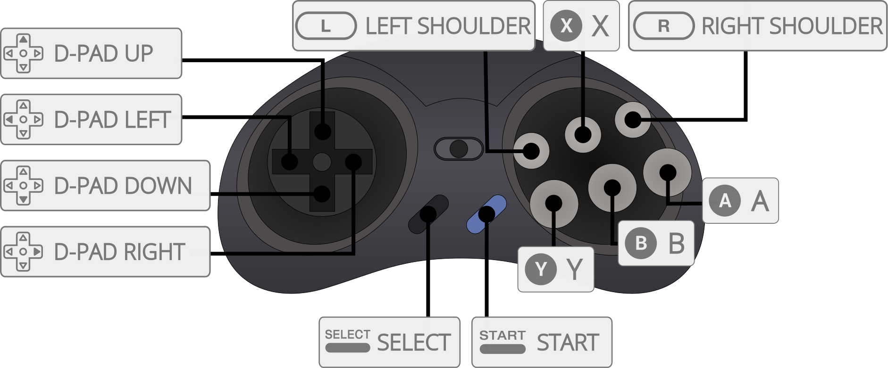

# Libretro Input API

## Overview

Libretro's input system is based on abstracted input device types:

 * RetroPad
    - Digitial Joypad
    - Analog and Digital Joypad
 * Mouse
 * Pointer
 * Keyboard
 * Lightgun

## RetroPad
The **RetroPad** is a joypad abstraction interface defined by the Libretro API. It is the primary input device for a libretro frontend. Unless a core absolutely requires the use of a keyboard with no possible fallback for gamepad-type controls, a [[Libretro core]] should always be implemented as such that it is directly controllable by the RetroPad.

In terms of button layout and functionality, the RetroPad is based on a PlayStation/Super Nintendo joypad.

### Specification
The minimum implementation required for the RetroPad abstraction:

* At least two shoulder buttons
* At least four face buttons
* At least one D-pad
* At least one analogue stick
* A `Start` button and a `Select`/`Back` button.

Above: An example of the RetroPad joypad abstraction mapped to the Megadrive 6-Button gamepad.

### Digital RetroPad
A RetroPad abstraction with all digital controls can be used. The conceptual arrangement for the buttons for the RetroPad is inspired by the Super Nintendo controller and the Sony Playstation DualShock.

### Analog RetroPad
A RetroPad abstraction with one or more analog inputs can be used. Conceptually inspired by the Sony DualShock2, this adds two analog sticks to the digital RetroPad and allows all buttons to return analog values in the range of `[-0x7fff, 0x7fff]`, although some devices may return `-0x8000`. Positive X axis is right. Positive Y axis is down. Buttons are returned in the range `[0, 0x7fff]`.

## Mouse Input
X and Y coordinates are reported relatively to last poll (poll callback) and it is up to the core to keep track of where the pointer coordinates with respect to the display.

## Pointer Input
The pointer abstraction represents pen, stylus, touch and other input devices that use absolute coordinates with respect to the screen.

Coordinates in X and Y are reported as `[-0x7fff, 0x7fff]`: `-0x7fff` corresponds to the far left/top of the screen, `0x7fff` to the far right/bottom of the screen. The "screen" is defined as area that is passed to the frontend and later displayed on the monitor. The frontend is free to scale/resize this screen as it sees fit but `(X, Y) = (-0x7fff, -0x7fff)` will always correspond to the top-left pixel of the display.

## Keyboard Input
The libretro API allows a core to poll the frontend for the raw current pressed state of keys. There is also a callback available which is called by the frontend in response to keyboard events. `down` is set if the key is being pressed and `false` if it is being released.

Even though the frontend should try to synchronize keypresses with keycode events, cores should assume that multiple characters can be generated from a single keypress. In other words, keycode events should be treated separately from character events. Similarily if only a keycode event is generated with no corresponding character, the character should be `0`.

## Lightgun Input
The libretro lightgun abstraction reports X/Y coordinates in screen space (similar to the pointer) in the range `[-0x8000, 0x7fff]` in both axes, with zero being center and `-0x8000` being out of bounds. The core an query the on/off screen state of the lightgun. It features a trigger, start/select buttons, auxiliary action buttons and a directional pad. A forced off-screen shot can be requested for
 auto-reloading function in some games.
