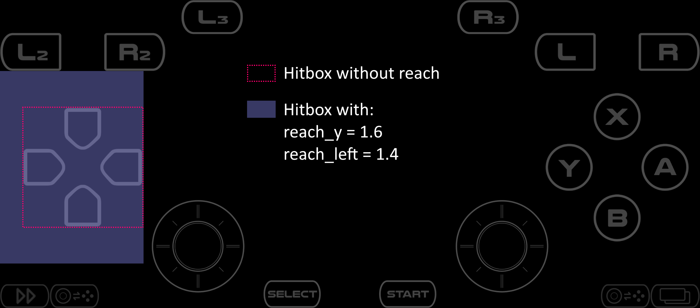
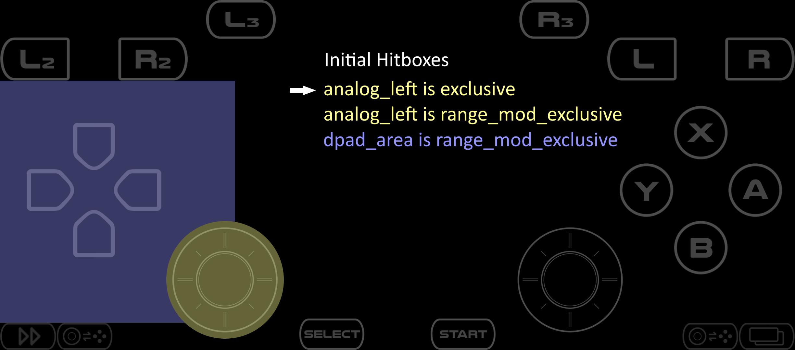
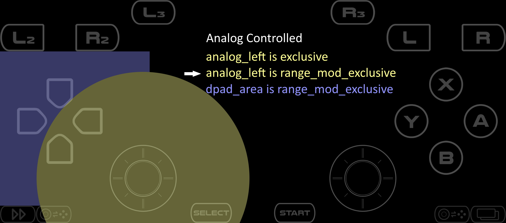
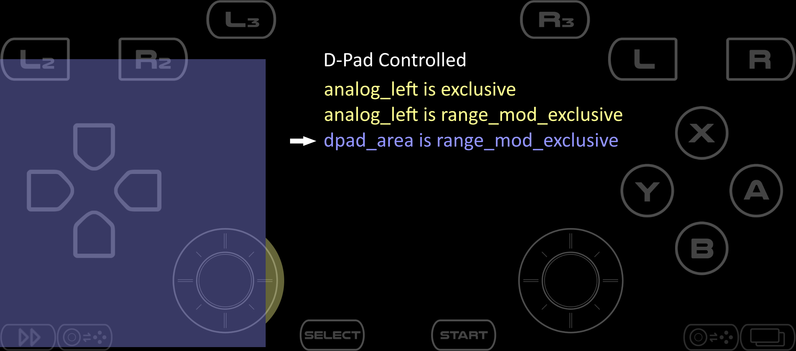

# Overlays

RetroArch supports overlay images for use with hardware accelerated drivers. The purpose of this is to allow some kind of input interface that is mouse/touch oriented. The overlay images are displayed with transparency over the regular game image, and the user is able to trigger input by pressing on certain parts of the overlay.

Since the overlay is a series of images, the user should be able to fully configure the look and functionality of this overlay. This allows skinners and themers to go wild.

### Libretro overlay repositories
The Libretro Organization hosts a repositories on Github that contains a compilation of overlays made with the Overlay Specification.

* Interactive overlays are managed within: https://github.com/libretro/common-overlays
* Decorative border overlays are managed within: https://github.com/libretro/overlay-borders

## Configuration

The overlay is described in a config file (.cfg). The config file uses the same config file syntax as RetroArch itself.

The overlay system supports use of multiple overlays that can be switched out on the fly. Input is not only restricted to gamepad input, but can also work with any input that is bindable in RetroArch, e.g. save states, rewind, load state, etc.

The config file describes:

- Which full-screen overlay images to use (.png, .tga, etc).
- The hitbox for each input event, i.e. "size" of the button.
- Which image should be shown over the input descriptors individually (optional).
- Where on the screen the entire overlay should be displayed.

## Overlay images

First we configure how many overlays we use. Every overlay can have one overlay which fills the entire rectangle (overlay%u_rect), but is optional. The full-rect overlay is supported for compatibility with older format. It is less flexible than per-button overlays and is discouraged.

    overlays = 2
    overlay0_overlay = overlay_img0.png # Optional
    overlay1_overlay = overlay_img1.png # Optional

The paths are relative to where the overlay config is loaded from. If the path is absolute, absolute paths will be used. On Unix-like systems ~/ is recognized as $HOME/.

## Screen placement

By default, the overlay image will be stretched out to fill the whole game image. However, for some overlays, this is not practical.

It is possible to set the placement using for example:

    overlay0_rect = "0.2,0.3,0.5,0.4"

We assume that the game screen has normalized coordinates in X and Y that span from [0, 0] in the top-left corner to [1, 1] in the lower-right corner.

This will render the overlay to x = 0.2, y = 0.3 with size width = 0.5, height = 0.4. The default (stretch to full screen) could be described as such:

    overlay0_rect = "0.0,0.0,1.0,1.0"

## Full-screen vs. full-viewport overlays

By default, overlays will be stretched out to fill game viewport. However, in some cases the aspect ratio of the game causes there to remain large black borders around the game image.

It is possible to stretch the overlay to full screen (instead of viewport) by specifying this option:

    overlay0_full_screen = true

## Coordinate descriptors

We must also describe where on the overlay image buttons can be found for each overlay. E.g.:

    overlay0_descs = 3 # Three buttons for this overlay in total
    overlay0_desc0 = "a,32,64,radial,10,20"
    overlay0_desc1 = "start,100,50,rect,80,10"
    overlay0_desc2 = "overlay_next,200,180,radial,40,40"

The format is:

    "button,position_x,position_y,hitbox_type,range_x,range_y"

button corresponds to the input event being generated. The names are the same as in the general input config, e.g. input_player1_start would translate to start here. If button is a keyboard key, it must be prefixed with retrok_, e.g. retrok_a. overlay_next is a special bind designed to swap to the next overlay, or wrap around to the first one. Button nul means no input.

For an up-to-date view of what buttons are called, check the input_config_bind_map variable in:
[https://github.com/libretro/RetroArch/blob/master/configuration.c](https://github.com/libretro/RetroArch/blob/master/configuration.c).

For an up-to-date view of what keyboard keys are called, check the input_config_key_map variable in:
[https://github.com/libretro/RetroArch/blob/master/input/input_keymaps.c](https://github.com/libretro/RetroArch/blob/master/input/input_keymaps.c).

position_x and position_y are the x and y coordinates in pixels of the source image for the center of the button. It is possible to use normalized coordinates as well. This is necessary when a full-screen overlay is not used. overlay0_desc0_normalized = true will force normalized coordinates. overlay0_normalized = true sets all descriptors to true unless overridden specifically.

hitbox_type describes which type of shape the button has. radial (circle, ellipse) and rect (rectangular) shapes are supported.

range_x and range_y describe the size of the button. The semantics differ slightly for radial and rect hitbox types. For radial shape, range_x and range_y describe the radius in x and y directions in pixels of the source image. For rect shape, the range_x and range_y values represent the distance from center to the edge of the rect in terms of pixels of the source image.

E.g. a range_x of 20 would mean the width of the rectangular is 40 pixels in total.

## Special button types

A few buttons are not listed in input_config_bind_map: analog_left, analog_right, dpad_area, and abxy_area.

analog_left and analog_right translate to analog sticks. These buttons must have hitbox type radial. It is possible to configure where saturation kicks in using overlay%u_desc%u_saturate_pct. E.g. a value of 0.75 means the 75% inner part contains the entire analog range. Outside the 75% it will be fully saturated.

dpad_area and abxy_area are 8-way areas whose input events are based on the direction pressed, i.e. angle from hitbox center. An 8-way area can be used as-is or redefined. E.g. this creates a d-pad consisting of analog directions, and a face button diamond consisting of A,B,R,L:

    overlay0_desc0 = "dpad_area,0.15,0.57,rect,0.1094,0.1944"
    overlay0_desc0_up = r_y_minus
    overlay0_desc0_down = r_y_plus
    overlay0_desc0_left = r_x_minus
    overlay0_desc0_right = r_x_plus
    overlay0_desc1 = "abxy_area,0.85,0.57,rect,0.1607,0.2857"
    overlay0_desc1_up = r
    overlay0_desc1_left = l

## Using per-button overlays

It is possible to use individual overlays per button. The given image will be displayed with same size as the hitbox in the input descriptor.

    overlay0_desc0_overlay = button.png

## Let overlay buttons move around when pressed

For especially overlay buttons which map to analogs, it is useful to allow an image to follow the movement of the finger. To enable an overlay to follow the finger movement within its bounding area use the movable attribute:

    overlay0_desc0_overlay = analog.png # Need some per-descriptor overlay
    overlay0_desc0_movable = true # Overlay image will now move around

## Let buttons light up when they are pressed

When using individial overlays per button it will make sense to have buttons light up when they are pressed. To do this, the alpha value per-button will be multiplied by a factor.

    overlay0_desc0_alpha_mod = 2.0 # Alpha is multiplied 2x when pressed.

To set a default across all descriptors for an overlay, you can do so:

    overlay0_alpha_mod = 2.0

## Adjust a button's hitbox

A button's hitbox can be adjusted without affecting its image, input center, or analog saturation. Use reach_x/y to multiply hitbox width/height symmetrically. Use reach_up/down/left/right to multiply hitbox range in that direction. E.g. this creates a d-pad and extends its hitbox vertically by 60%, and left by 40%:

    overlay0_desc0 = "dpad_area,0.15,0.57,rect,0.1094,0.1944"
    overlay0_desc0_reach_y = 1.6 # Multiply hitbox height
    overlay0_desc0_reach_left = 1.4 # Multiply hitbox width on left side

Setting reach_x or reach_y to 0 removes the hitbox. The button then can't be pressed, but it will still light up if another button creates the same input. This is useful for animating a dpad_area or abxy_area.

## Let buttons have bigger hitbox when they are pressed

When pressed, you can make the hitboxes larger while the button is pressed:

    overlay0_desc0_range_mod = 1.5 # For the particular descriptor
    overlay0_range_mod = 1.5 # Default for all descriptors

## Handling hitbox overlap

Avoid unwanted overlap by making a button exclusive and/or range_mod_exclusive. An exclusive button blocks other buttons pressed by the same finger. A range_mod_exclusive button blocks with higher priority, but only when range_mod is in effect, i.e. one poll after it is pressed.

E.g. this overlaps an analog stick and a d-pad. The analog is exclusive, so initially it owns the overlapped hitbox area. Both buttons are range_mod_exclusive, so the one controlled first owns its range_mod extended hitbox area.

    overlay0_desc0 = "dpad_area,0.15,0.57,rect,0.1094,0.1944"
    overlay0_desc0_reach_x = 2.08
    overlay0_desc0_reach_up = 1.62
    overlay0_desc0_reach_down = 1.96
    overlay0_desc0_range_mod = 1.2
    overlay0_desc0_range_mod_exclusive = true # Give dpad_area priority if controlled first
    overlay0_desc1 = "analog_left,0.31,0.81,radial,0.0964,0.1928"
    overlay0_desc1_exclusive = true # Give analog_left priority on first touch
    overlay0_desc1_range_mod = 2.75
    overlay0_desc1_range_mod_exclusive = true # Give analog_left priority if controlled first

## Triggering multiple buttons with one desc

It's possible to trigger multiple buttons (e.g. diagonals) with one overlay desc.

    overlay0_desc0 = "left|up,32,64,radial,10,20"

will trigger both left and up at same time. Keyboard keys are an exception; an overlay desc can have only one key.

## Go to arbitrary overlay index

To build some kind of menu system, one would need the ability for overlay_next to refer to any overlay. To do this, two extra things must be configured:

    overlay2_overlay = "some_overlay.png"
    overlay2_name = "overview_overlay" # A name which can be referred to. Must be set if it is to be refered to.

    overlay0_desc0 = "overlay_next,200,180,radial,40,40"
    overlay0_desc0_next_target = "overview_overlay" # When this overlay_next is pressed, it will go to index 2 directly, instead of the default 1.
