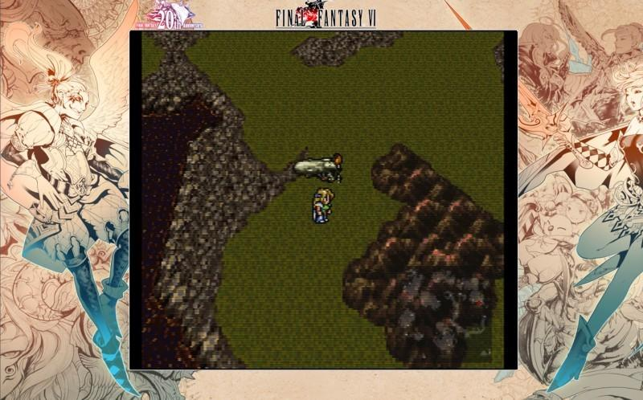

# Shader lookup textures

A popular feature among RetroArch users the ability to access external textures. This means we have several samplers available for use. In the config file, we define the textures as so:

```
textures = " foo ; bar"
foo = path_foo.png
bar = bar_foo.png
foo_linear = true # Linear filtering for foo.
bar_linear = true # Linear filtering for bar.
```

RetroArch PS3 uses PNG as the main format, RetroArch can use whatever if Imlib2 support is compiled in. If not, it’s restricted to lop-left ordered, non-RLE TGA.

From here on, `foo` and `bar` can be found as uniforms in the shaders. The texture coordinates for the lookup texture will be found in `TEXCOORD1`. This can simply be passed along with `TEXCOORD0` in the vertex shader as we did with `TEXCOORD0`.

Here we make a fragment shader that blends in two background picture at a reduced opacity. Do NOT assign lookup textures to a certain `TEXUNIT`, Cg will assign a fitting texture unit to the sampler.

```c
float4 main_fragment ( uniform sampler2D s0 : TEXUNIT0,
                       uniform sampler2D foo,
					   uniform sampler2D bar,
					   float2 tex : TEXCOORD0,
					   float2 tex_lut : TEXCOORD1) : COLOR
{
   float4 bg_sum = (tex2D(foo, tex_lut) + tex2D (bar , tex_lut)) * 0.15;
   return lerp (tex2D(s0, tex), bg_sum, bg_sum.a); // Alpha blending.
}
```

## Results: a shader for drawing a background border


