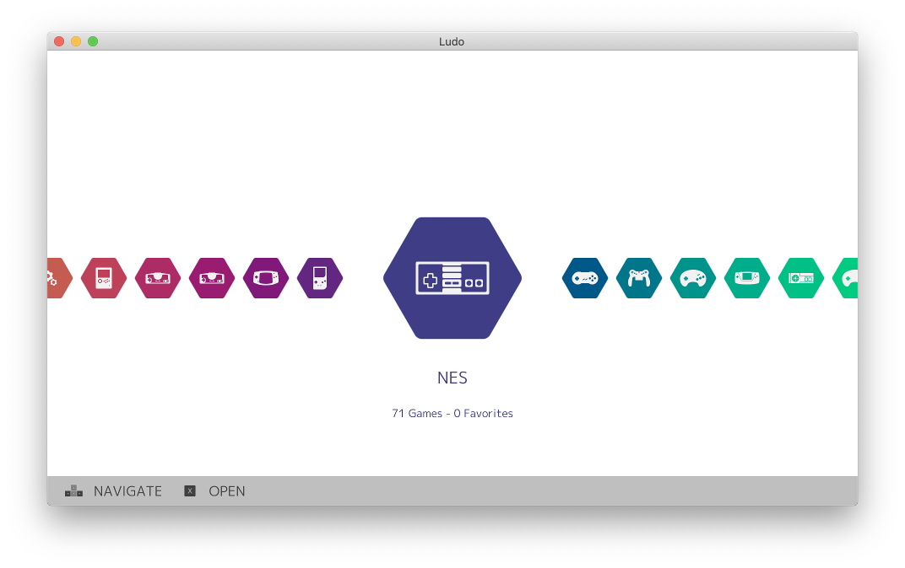
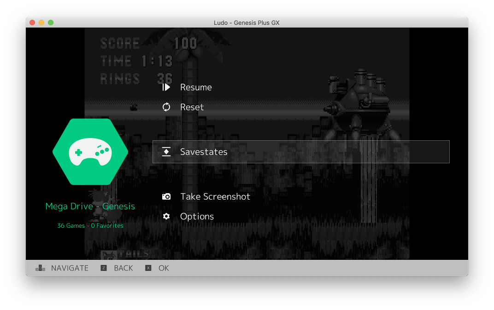

# Downloading, Installing and Updating Ludo for PC.

<iframe width="560" height="315" src="https://www.youtube-nocookie.com/embed/TvvylIT1-wM" frameborder="0" allow="accelerometer; autoplay; clipboard-write; encrypted-media; gyroscope; picture-in-picture" allowfullscreen></iframe>

## What is it?
___
Ludo is an Emulator Frontend able to run retro video games. Ludo does not emulate the consoles itself, but does it through emulator plugins called libretro cores. Libretro cores are well known emulators (like Snes9x or Genesis Plus GX or PCSX) stripped from their user interface. They contain only console specific logic.

| :warning: DISCLAIMER          |
|:---------------------------|
| Ludo is still under heavy development. In its current state, the project allows you to play most games on most platforms. However, expect bugs, missing features or features not working as intended, and hardware that is yet to be supported. If you find a bug, you can declare it in our [tracker](https://github.com/libretro/ludo/issues), unless already reported.      |

## Prerequisites

- GLFW 3.3
- OpenGL >= 2.1
- OpenAL

## Download Ludo
___

Click here to get the [latest](https://github.com/libretro/ludo/releases/latest) version.

Please note that due to early development phase, Ludo _may_ not work on your OS as expected. In most scenarios, Ludo works as intended.

## Ludo

[Ludo](http://ludo.libretro.com/) is a minimalist frontend for emulators. [Ludo is part of LibRetro](https://github.com/libretro/ludo). Separating the frontend from the emulation logic has the following advantages:

- Frontend developers only have to code the user interface once
- Developing a new frontend functionality can benefit all the emulators at once
- Emulator developers can benefit from a mature user interface without coding it
- Gamers can configure emulators all at once
- The user interface, configuration, and storage are consistent across emulators

From the gamer perspective, Ludo is a universal retro game browser and player. It offers a gaming experience optimized for TV and gamepads, but can also be used on a traditional PC with a keyboard.

Currently, Ludo can run on the following platforms:

- Windows 64-bit (Tested on Windows 10)
- Max OS X 64-bit
- Linux 64-bit
- Linux on Raspberry Pi 32-bit

There is also an Operating System version of Ludo called LudOS. It looks and behaves exactly the same, but can be burnt to a USB drive or an SD card to recreate a video games console experience. You can setup LudOS on a dedicated TV box to enjoy gaming from your couch. You can also boot it off USB on any laptop in a perfectly portable way.

### Features 

Ludo's User Interface has the following functionalities:

- Gamepad driven: everything can be done through the gamepad instead of the mouse
- TV optimized: looks nice on a wide screen
- Controller auto configuration when plugged
- Automatic configuration of literally everything
- Game collection scanner for generating playlists with thumbnails
- Video filters through simple shaders
- Taking game screenshots
- Saving/Loading game state anytime, organized by date with screenshots
- Emulator specific settings
- Soft-patching .ips and .ups

### Focus on playing

Ludo's user interface is distraction free and configuration is always optional.

Scan your games and browse your collection categorized by system with playlists showing in-game screenshots.

A contextual menu gives you access to actions and quick save / quick load anytime.

We chose the best emulators for the job, configured with sane defaults guaranteeing a balance of speed and accuracy.

### Ludo as an Operating System

Ludo also exists in the form of an Operating System called LudOS.
It behaves and looks exactly the same and can be installed directly on a TV Box to recreate a game console experience.

- [PC 64bit](https://github.com/libretro/LudOS/releases/download/v1.0-alpha30/LudOS-Generic.x86_64-1.0-alpha30.img.gz)
- [Raspberry Pi 2/3](https://github.com/libretro/LudOS/releases/download/v1.0-alpha30/LudOS-RPi2.arm-1.0-alpha30.img.gz)
- [Raspberry Pi 4](https://github.com/libretro/LudOS/releases/download/v1.0-alpha30/LudOS-RPi4.arm-1.0-alpha30.img.gz)

The OS version of Ludo, LudOS, adds these OS centric functionalities:

- Flash-able using Etcher
- Auto expanded filesystem on first boot
- Connecting to Wi-Fi networks, with a virtual keyboard
- Robust monolithic updates for the OS
- Adding games through Windows Share protocol or SSH
- Controlling services like SSH, Samba, Bluetooth
___

## Frequently Asked Questions

You may have a lot of questions or ideas about Ludo, some of which we tried to answer below. Apart from that, you can also ask your questions via [Discord](https://discord.gg/2gChcFZ).

### How is Ludo different from RetroArch?

Ludo will stay smaller than RetroArch by only implementing the core features and by targeting less platforms.
By not adding advanced functionalities we aim to deliver a stable frontend for beginner users on Windows, Mac OSX and Linux.
Some design choices are different, for example we support less cores, and choose cores for the user. The cores are packaged in the frontend so no additional step is required to launch a game.

### How is Ludo similar to RetroArch?

As RetroArch, Ludo is a libretro frontend, so the way of communicating with the emulators is the same.
Same cores, similar UI patterns, gamepad driven UI, same game thumbnails, mostly the same game database, same terminology. I think we can also say same developers, as I am an important contributor of the libretro team, and all the people who provided me with help are also member of the libretro community.
It definitely shares the same values.

### Why not implementing Ludo as a menu driver in RetroArch?

To keep a software stable on a number of different platforms, it is important to keep a small codebase with a good test coverage. It is also important to not introduce changes at a high rate.
RetroArch is an extremely active project and has a growing codebase that makes it harder to reach stability.
Also, RetroArch is a very powerful and sophisticated frontend, and one of the common criticism is that it exposes too many configuration options for the average retro gamer.
Implementing Ludo as a menu driver of RetroArch would solve none of these issues.

### Does Ludo offer a better scanning method compared to RetroArch?

No, the scanner logic is basically the same and Ludo supports even less ROM formats.
CDs are scanned based on file name instead of serial number.
Ludo's scanner faster for this reason and because it leverages goroutines.

### Can you add feature X to Ludo?

The answer is likely to be no, as we're trying to keep the code small, only bugfixes are really welcome.
We encourage you to fork Ludo and add the feature yourself. It should be fairly easy given the scope of the project.
If you are able to author a very useful improvement with a minimum of changes we might merge your change.

### Emulated consoles

Ludo includes the following libretro cores (emulators):

bluemsx fbneo fceumm gambatte genesis_plus_gx handy mednafen_ngp mednafen_pce_fast mednafen_psx mednafen_saturn mednafen_supergrafx mednafen_vb mednafen_wswan mgba np2kai o2em pcsx_rearmed picodrive pokemini prosystem snes9x stella vecx virtualjaguar

Ludo can run games from these consoles:

Atari 5200, Atari 7800, Atari Jaguar, Atari Lynx, GCE Vectrex, MSX, MSX2, Various Arcade Games, Game Boy, Sega SG-1000, Sega Game Gear, Sega Master System, Sega Genesis / Mega Drive, Sega 32X, Sega CD, Sega Saturn, Nintendo NES, Super Nintendo / Super Famicom, Nintendo Virtual Boy, Nintendo Game Boy, Nintendo Game Boy Advance, NEC PC Engine, NEC PC Engine CD, NEC PC-98, NEC PC-FX, Sharp X68000, Sony PlayStation, 3DO

## Conclusion
___
Ludo is still under heavy development. In its current state, the project allows you to play most games on most platforms. More information can be found in the [Ludo documents](https://github.com/libretro/ludo/wiki).