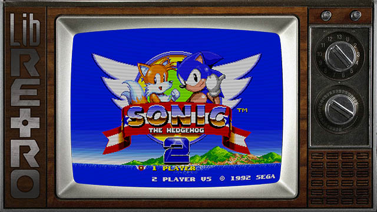

# What is a Libretro Overlay?

Imagine a libretro core playing a game or video on your screen. Now imagine attaching a clear piece of glass over your screen that you can draw on, attach touchscreen buttons to, or use to display an image of a vintage CRT television in your old bedroom.

That layer of glass would be the **overlay** -- a virtual 'layer' between you and the video signal.

<iframe width="560" height="315" src="https://www.youtube-nocookie.com/embed/bRNbA-4wuSc" frameborder="0" allow="accelerometer; autoplay; clipboard-write; encrypted-media; gyroscope; picture-in-picture" allowfullscreen></iframe>

### What's the difference between an Overlay and a Bezel?

With Libretro, **bezels** are one subtype of **overlay**. If you have experience with game emulators, you may be familiar with the term Bezel, which describes images that wrap around the emulated screen. Often this is to display an image of the original arcade cabinet or game console being emulated.

[dan2hos demonstrated this bezel-style overlay for Sonic 2 in the libretro forums](https://forums.libretro.com/t/libretro-classic-tv-overlay-border/3820:
;

### What's the difference between an Overlay and a Shader?

Shaders manipulate the video image being displayed by the Libretro core, so often the two are used in tandem. For example, you might want to use **shaders** to manipulate a Sega Genesis emulator core's video output to look just like a vintage Trinitron CRT television. Then you might use an **overlay** to wrap an image of that exact television around the emulated video.

Another way that **shaders** and **overlays** are used together is to 1) use a **shader** to enhance dithered or low resolution images from a handheld emulator core as they are displayed on a modern HD smartphone and then 2) use an **overlay** to add touchscreen buttons to that emulator.

# Overlay Touchscreen Functionality

Overlay touch functionality allows users to create an input interface that is mouse or touch oriented regardless of whether the original system or libretro core was built for these forms of input. The overlay images are displayed with transparency over the regular game image, and the user is able to trigger input by pressing on designated parts of the overlay.

Overlays are built from a collection of images and a text configuration file which makes it straightforward to change both the look and functionality of this overlay. Learn more about this aspect of Libretro's Overlay tech over in the Overlay Spec.

An example of a touchscreen overlay, demonstrated with the Dinothawr core:

# Activating an Overlay via the GUI

Overlays require at least one image (`.png`) and a configuration file (`.cfg`) in order to activate them.

**Notes:**
- The configuration file should have the exact same name as the first image file (the only image file if your overlay only has one image).
- Do not use spaces in the filename.
- These files should be placed together in the libretro `overlay` folder.

In order to activate an overlay, go to the RetroArch `Settings` menu. Find the `Onscreen Display` submenu. From this menu you can activate the Overlay system and select which overlay file to display.

# Setting Up Per-Core Overlays in RetroArch

## Per-Core Overlays via the RetroArch GUI

1. Go to the `Settings` menu and find the `User Interface` submenu and enable `Show Advanced Settings`
2. Go to the `Settings` menu and find the `Configuration` submenu. Make sure that `Use Content-Specific Core Options If Available` and `Load Override Files Automatically` are enabled.
3. Set up the Overlay according to your preferences.
3. Load a game. Open the RA "Quick Menu" and then use the GUI to set up the Overlay according to your preferences.
4. From the Quick Menu, select `Save Core Overrides`.

## Per-Core Overlays via RetroArch CFG Files

To be written

# Setting Up Per-Game Overlays in Retroarch

## Per-Game Overlays via the RetroArch GUI

1. Go to the `Settings` menu and find the `User Interface` submenu and enable `Show Advanced Settings`
2. Go to the `Settings` menu and find the `Configuration` submenu. Make sure that `Use Content-Specific Core Options If Available` and `Load Override Files Automatically` are enabled.
3. Load a game. Open the RA "Quick Menu" and then use the GUI to set up the Overlay according to your preferences.
4. From the Quick Menu, select `Save Game Overrides`.

## Per-Game Overlays via RetroArch CFG Files

The first time you set up a per-game overlay:
1. Ensure that these two options are set in retroarch.cfg: `game_specific_options = "true"` and `auto_overrides_enable = "true"`
2. The first time you load content with these settings, RetroArch will create a settings override directory structure and a `.opts` configuration file which you can use as a template to correctly name and locate your overlay configuration files.
3. If the automatically-generated file is named `Dinothawr.opts`, you would name your per-game override `Dinothawr.cfg`.
3. The new RetroArch `.cfg` should only include the options you want to change for this single game.

#### Overlay options that can be changed include:
- `input_overlay` - Path to the correct overlay
- `input_overlay_enable`
- `input_overlay_opacity`
- `input_overlay_scale`
- `input_overlay_enable_autopreferred`
- `input_overlay_show_physical_inputs`
- `input_overlay_hide_in_menu`

**Note:** You can change more than just the overlay by specific any content-specific options -- for example you might also decide to set `video_shader_enable = "true"` and `video_shader = "/usr/share/libretro/shaders/classic-crt-television.slang"`, etc.

# Where can one find Overlays to use?

- Interactive overlays are managed within: https://github.com/libretro/common-overlays
- Decorative border overlays are managed within: https://github.com/libretro/overlay-borders

# More about Overlays

- Visit the official [Libretro Overlays Forum](https://forums.libretro.com/c/retroarch-additions/retroarch-overlays)
- [RetroArch Overlay Guide at emulationguide.com](http://emulationguide.com/retroarch-overlays)
