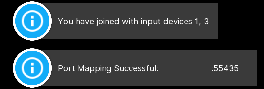

## Assigning Controllers During Netplay

### Request Device

**Request Device** is an advanced network option used for NetPlay, that allows each RetroArch instance to request which device(s)/controller(s) to control. This, for example, enables four players from two instances of RetroArch, or for a connecting client to request the player 1 controller from the host. To make this option visible, RetroArch must have **Show Advanced Settings** set to _ON_.

#### Turning on **Show Advanced Settings**

- Navigate to **Settings**
- Navigate to **User Interface**
- Toggle **Show Advanced Settings** to _ON_

Once **Show Advanced Settings** is on, proceed to the **Network** configurations in the **Settings** menu (**NetPlay** menu also has a path to **Network** configurations). Scroll down through **Network** configuration, and the advanced configuration options are now visible. **Request Device #** _(where # is any number from 1 to 16)_ options will allow the computer to control any number of controllers during NetPlay.

## Example Setup: Step-by-Step Guide

The following example of Super Bomberman 2 on the SNES will be used to demonstrate four players using two computers. The host will be controlling players 1 and 3, and the client will be controlling players 2 and 4.

### On the Host

#### Configure Host's Input Devices

Set up **Input Devices** while the game is loaded:

- Connect two controllers
- Start SNES Super Bomberman 2 game
- Set **Inputs** for each controller 1 and 2:
  - Navigate to **Settings**
  - Navigate to **Inputs**
  - Navigate to **Port 1 Binds**
  - Ensure **Device Index** is set to *_Controller Name 1_
  - Return to **Inputs** configuration menu
  - Navigate to **Port 2 Binds**
  - Ensure **Device Index** is set to *_Controller Name 2_
  - Set **Device Type** to _MultiTap_
    - _MultiTap_ is only available when SNES core is loaded. This plugs in a virtual SNES MultiTap into the SNES so more than two controllers can connect to the SNES.

    \* Controller Name 1 and 2 are unique to the computer and to the controllers connected to it (_e.g._, PS4 controller shows as "Wireless Controller \#1")

#### Configure Host's Requested Devices

Set host computer's RetroArch NetPlay to request control of the running core's devices/controllers:

- Navigate to **Settings** -or- **NetPlay**
- Navigate to **Network**
- Set **Request Device 1** to _YES_
- Set **Request Device 3** to _YES_
- Ensure all other **Request Device #** are set to _NO_

Host is now able to start a NetPlay game controlling controllers 1 and 3. See [Getting Started Guide](netplay-getting-started.md) for more details.

### Client

#### Configure Client's Input Devices

Set up **Input Devices** while the game is loaded:

- Connect two controllers
- Start SNES Super Bomberman 2 game
- Set **Inputs** for each controller 1 and 2:
  - Navigate to **Settings**
  - Navigate to **Inputs**
  - Navigate to **Port 1 Binds**
  - Ensure **Device Index** is set to *_Controller Name 1_
  - Return to **Inputs** configuration menu
  - Navigate to **Port 2 Binds**
  - Ensure **Device Index** is set to *_Controller Name 2_

    \* Controller Name 1 and 2 are unique to the computer and to the controllers connected to it (_e.g._, PS4 controller shows as "Wireless Controller \#1")

#### Configure Client's Requested Devices

Set client computer's RetroArch Netplay to request control of the running core's devices/controllers:

- Navigate to **Settings** -or- **Netplay**
- Navigate to **Network**
- Set **Request Device 2** to _YES_
- Set **Request Device 3** to _YES_
- Ensure all other **Request Device #** are set to _NO_

Client is now able to join the Host in a NetPlay game controlling controllers 2 and 4. See the [Getting Started Guide](netplay-getting-started.md) for more details.

!!! Warning
    RetroArch **Network** typically has all **Request Device #** set to _NO_. When all **Request Device #** are set to _NO_, this allows NetPlay to automatically set host as device/controller 1. When the client connects to the host, the client will connect to device/controller 2 for the NetPlay session. Each subsequent client that connects will continue connect to the next available device/controller. For this automatic client-to-controller assignment in a RetroArch NetPlay session to work, all **Request Device #** settings must be set to _NO_. If any connecting clients request a device, automatic assignment is disabled for everyone and all clients must request a device via the settings menu.
