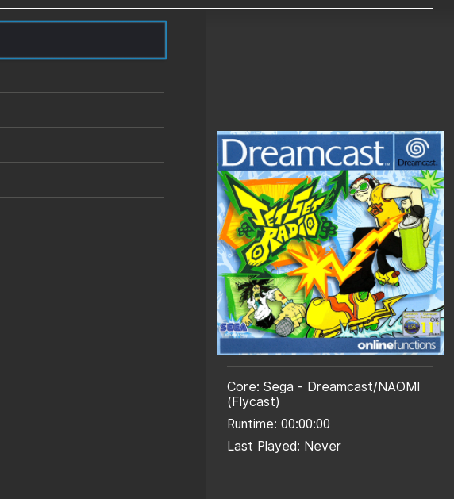

# Ozone (GUI)

**Ozone** is the default graphical user interface (gui) of RetroArch. Based on the Switch's menu design, this menu driver was introduced in RetroArch 1.7.6.

|DISCLAIMER|
|----------|
|Keyboard key assignments may differ by platform and configuration: Most of the examples below are for PC.|

## Menu structure

Ozone's main categories and playlists are in a column on the left, and subcategories are in a panel to the right. A third column will appear on the right hand side when certain selections are made.

Entering a subcategory will hide the top-level menu's text labels. When you return to Main Categories, the descriptions will reappear. The sidebar does not collapse while in Main Menu or Settings.

If you want the labels to always be hidden, go to `Settings> User Interface> Appearance`, then turn `Collapse the Sidebar` on.

### Navigating the menus

Ozone is controlled like any other user interface. Regular input binds will apply, and binds here are defined in terms of the RetroPad, RetroArch's gamepad and joystick abstraction.

| Controller   | Default PC | Action |
| ------------ | ---------- | ------ |
| **A button** | Z/ENTER/Left mouse click | Accept/OK |
| **B button** | X/Backspace/Right mouse click | Back/Cancel |
| **D-pad Up/Down/Left/Right** | Arrow keys | Scroll through menu options |
| N/A          | **Right shift** | Toggle description label |
| N/A          | **S key** | Toggle search |
| N/A          | **F1** | Toggle quick menu |
| N/A          | **F5** | Toggle desktop menu |

See [Input and Controls](input-and-controls.md).

### Searching through lists with the keyboard

When using a keyboard, it can be slow to navigate a large list using gamepad-like controls. To help this, you can type `/` (forward slash) or `S` (S key) at any time to bring up a search box.

Type a search string and hit `Return`. The cursor should jump to the first entry that matches.

The search will match mid-path strings. However, if a match is found at the beginning of the path (like when searching for the first letter), the start-of-path match will take priority.

## Input

See [Input and Controls](input-and-controls.md).

## Thumbnails

Thumbnails appear in a side bar on the right side of the screen. With a playlist item selected, you can press the `spacebar` on your keyboard to toggle the full-screen view on/off.

The default thumbnail is Boxart. Two thumbnails can be displayed simultaneously by going to `Settings> User Interface> Appearance` and enabling `Secondary Thumbnail`. The user can choose to display boxart, the title screen, or a gameplay screenshot.

## Audio

Ozone has **OK**, **Cancel**, **Notice** and **Scroll** sound effects. It also has background music, created by [ViRiX Dreamcore](https://soundcloud.com/virix).

<audio controls>
  <source src="/image/retroarch/ozone/bgm.ogg" type="audio/ogg">
</audio>

These are turned off by default. To enable them, go to `Settings> Audio> Menu Sounds` and turn on the `Mixer`. Then in the same menu, turn on the sounds you want (the background music option is called `Enable BGM Sound`).

## Applying shaders

See the [shaders user guide](shaders.md).

## Themes

Ozone has a range of color schemes to choose from. They can be found in `Settings> User Interface> Appearance> Color Theme`.

