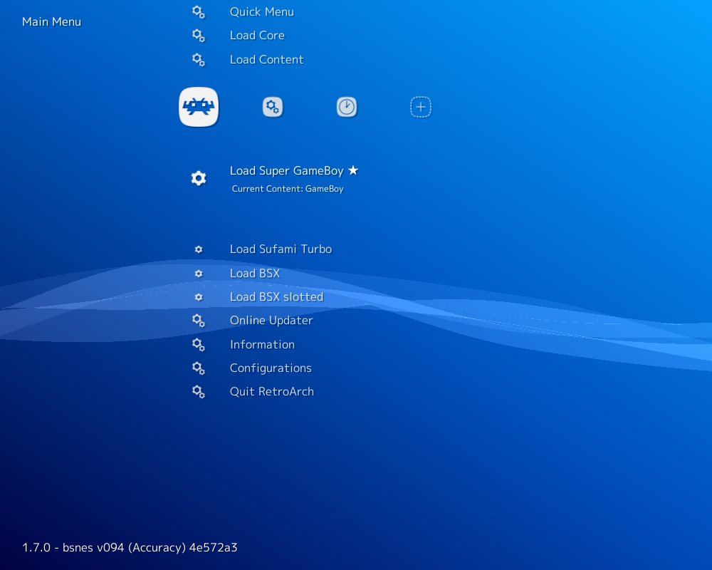
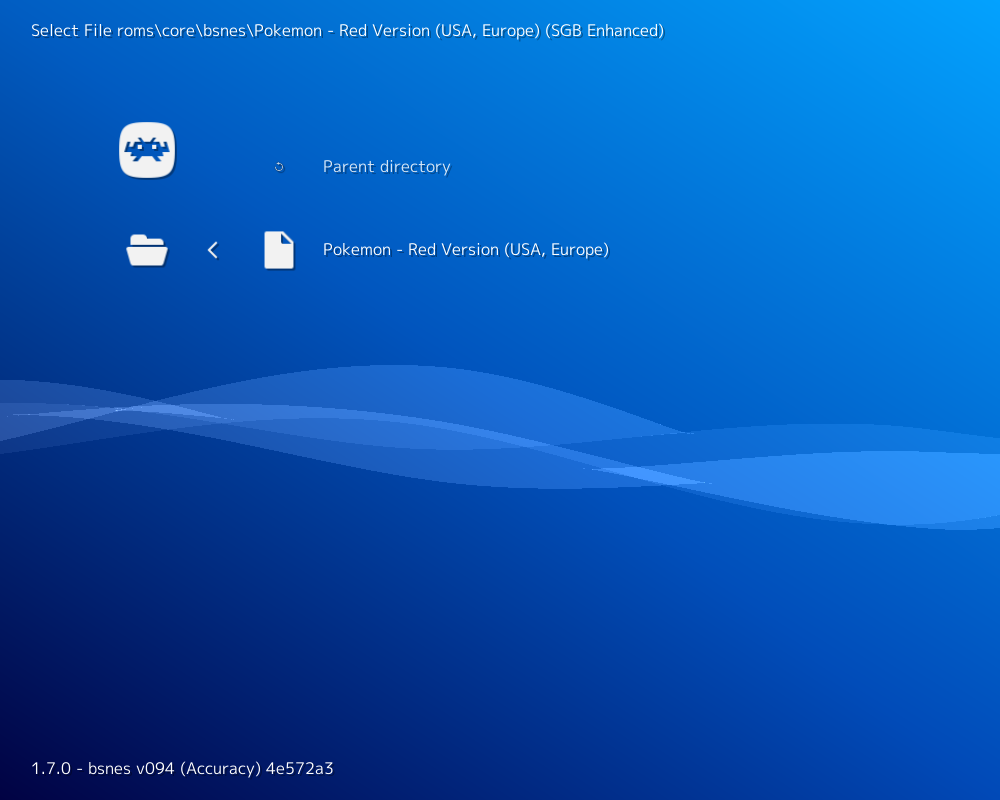
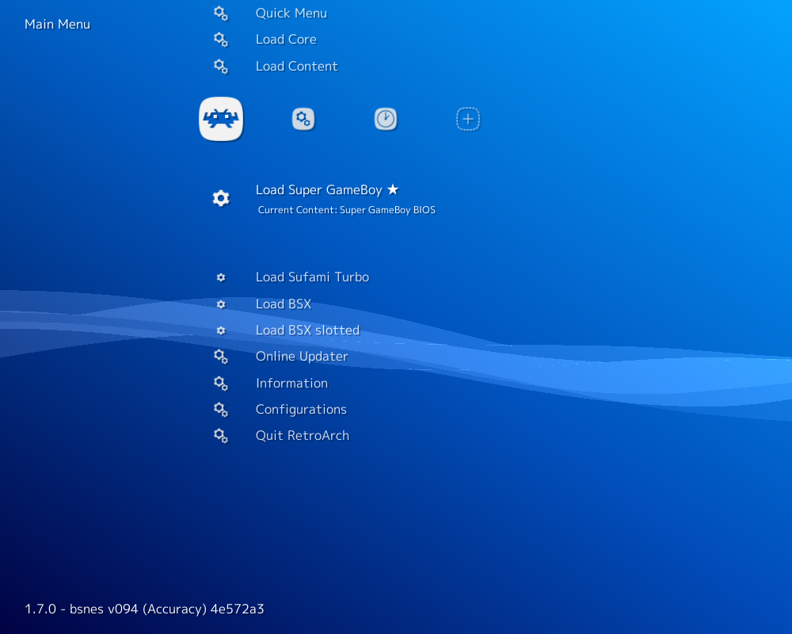
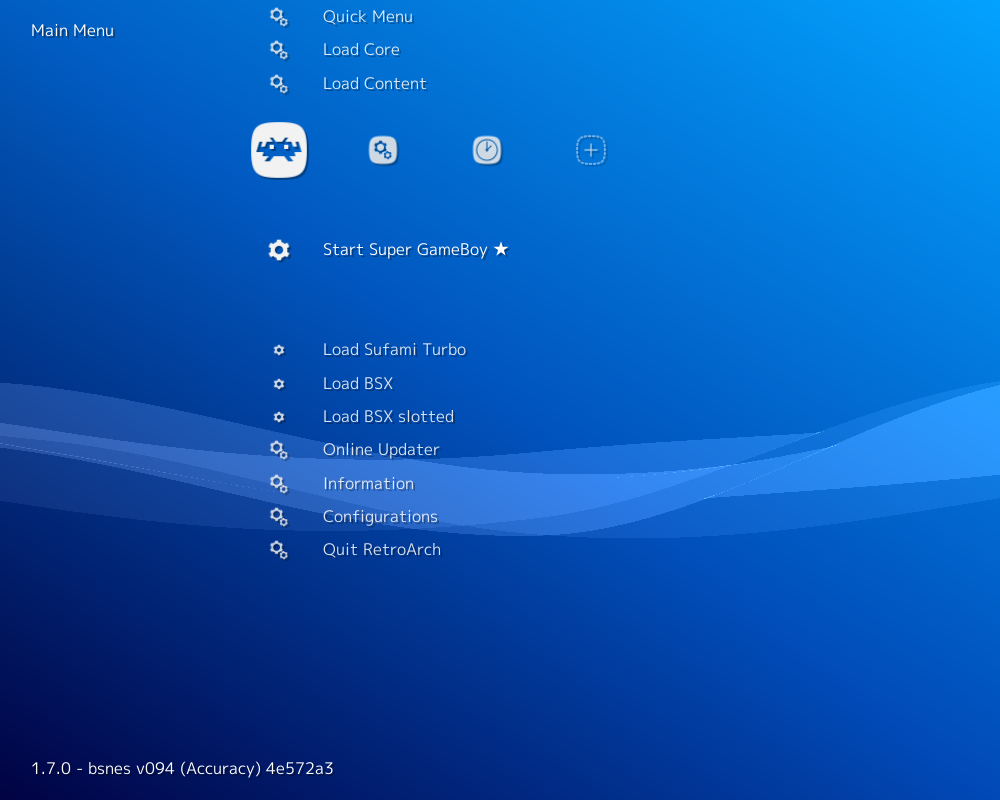
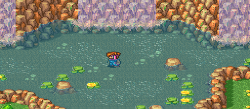

# Nintendo - SNES / Famicom (bsnes-mercury Accuracy)

## Background

bsnes-mercury is a fork of higan, aiming to restore some useful features that have been removed, as well as improving performance a bit.
Maximum accuracy is still uncompromisable; anything that affects accuracy is optional and off by default.

This core has been compiled with the Accuracy profile.

Improvements include:

* Improved framerate
* Faster ROM loading
* HLE emulation of some special chips is optionally restored (defaults to LLE), to improve performance and reduce reliance on those chip ROMs (they're not really easy to find). Chips for which no HLE emulation was developed (ST-0011 and ST-0018) are still LLE.
* SuperFX overclock is now available (off by default, of course); if enabled, it makes SuperFX look quite a lot smoother.

**The bsnes-mercury cores are not less accurate at default settings than the mainline bsnes cores (you have to explicitly enable 2 core options to switch to the less accurate special chip HLE).**

### Author/License

The bsnes-mercury Accuracy core has been authored by

- byuu
- Alcaro

The bsnes-mercury Accuracy core is licensed under

- [GPLv3](https://github.com/libretro/bsnes-mercury/blob/master/LICENSE)

A summary of the licenses behind RetroArch and its cores have found [here](../development/licenses.md).

## Extensions

Content that can be loaded by the bsnes-mercury Accuracy core have the following file extensions:

- .sfc
- .smc
- .bml

## Databases

RetroArch database(s) that are associated with the bsnes-mercury Accuracy core:

- [Nintendo - Super Nintendo Entertainment System](https://github.com/libretro/libretro-database/blob/master/rdb/Nintendo%20-%20Super%20Nintendo%20Entertainment%20System.rdb)
- [Nintendo - Super Nintendo Entertainment System Hacks](https://github.com/libretro/libretro-database/blob/master/rdb/Nintendo%20-%20Super%20Nintendo%20Entertainment%20System%20Hacks.rdb)
- [Nintendo - Sufami Turbo](https://github.com/libretro/libretro-database/blob/master/rdb/Nintendo%20-%20Sufami%20Turbo.rdb)

## BIOS

Required or optional firmware files go in the frontend's system directory.

| Filename          | Description                            | md5sum                           |
|:-----------------:|:--------------------------------------:|:--------------------------------:|
| dsp1.data.rom     | DSP1 co-processor firmware             | 3d81b45fa0c2aa8b852dfb1ece7c0971 |
| dsp1.program.rom  | DSP1 co-processor firmware             | ae209fbe789fbf11a48aea5ab1197321 |
| dsp1b.data.rom    | DSP1B co-processor firmware            | 1e3f568634a7d8284020dddc0ae905bc |
| dsp1b.program.rom | DSP1B co-processor firmware            | d10f446888e097cbf500f3f663cf4f6d |
| dsp2.data.rom     | DSP2 co-processor firmware             | e9417e29223b139c3c4b635a2a3b8744 |
| dsp2.program.rom  | DSP2 co-processor firmware             | aa6e5922a3ed5ded54f24247c11143c5 |
| dsp3.data.rom     | DSP3 co-processor firmware             | 0a81210c0a940b997dd9843281008ee6 |
| dsp3.program.rom  | DSP3 co-processor firmware             | d99ca4562818d49cee1f242705bba6f8 |
| dsp4.data.rom     | DSP4 co-processor firmware             | ee4990879eb68e3cbca239c5bc20303d |
| dsp4.program.rom  | DSP4 co-processor firmware             | a151023b948b90ffc23a5b594bb6fef2 |
| cx4.data.rom      | CX4 co-processor firmware              | 037ac4296b6b6a5c47c440188d3c72e3 |
| st010.data.rom    | ST010 co-processor firmware            | 254d70762b6f59f99c27c395aba7d07d |
| st010.program.rom | ST010 co-processor firmware            | 1d70019179a59a566a0bb5d3f2845544 |
| st011.data.rom    | ST011 co-processor firmware            | 10bd3f4aa949737ab9836512c35bcc29 |
| st011.program.rom | ST011 co-processor firmware            | 95222ebf1c0c2990bcf25db43743f032 |
| st018.data.rom    | ST018 co-processor firmware            | 49c898b60d0f15e90d0ba780dd12f366 |
| st018.program.rom | ST018 co-processor firmware            | dda40ccd57390c96e49d30a041f9a9e7 |
| sgb.boot.rom      | Super Game Boy BIOS                    |                                  |

## Features

Frontend-level settings or features that the bsnes-mercury Accuracy core respects.

| Feature           | Supported |
|-------------------|:---------:|
| Restart           | ✔         |
| Screenshots       | ✔         |
| Saves             | ✔         |
| States            | ✔         |
| Rewind            | ✔         |
| Netplay           | ✔         |
| Core Options      | ✔         |
| RetroAchievements | ✔         |
| RetroArch Cheats  | ✔         |
| Native Cheats     | ✕         |
| Controls          | ✔         |
| Remapping         | ✔         |
| Multi-Mouse       | -         |
| Rumble            | ✕         |
| Sensors           | ✕         |
| Camera            | ✕         |
| Location          | ✕         |
| Subsystem         | ✔         |
| [Softpatching](../guides/softpatching.md) | ✔         |
| Disk Control      | ✕         |
| Username          | ✕         |
| Language          | ✕         |
| Crop Overscan     | ✕         |
| LEDs              | ✕         |

### Directories

The bsnes-mercury Accuracy core's internal core name is 'bsnes-mercury'

The bsnes-mercury Accuracy core saves/loads to/from these directories.

**Frontend's Save directory**

- 'content-name'.srm (Cartridge battery save)

**Frontend's State directory**

- 'content-name'.state# (State)

### Geometry and timing

- The bsnes-mercury Accuracy core's core provided FPS is 60.0988118623 for NTSC games and 50.0069789082 for PAL games.
- The bsnes-mercury Accuracy core's core provided sample rate is 32040.5 Hz
- The bsnes-mercury Accuracy core's core provided aspect ratio is dependent on the ['Preferred aspect ratio' core option](#core-options).

## Super GameBoy

!!! warning
	Super GameBoy support in this core is **Windows only**, and has **buggy save state support** and **visual glitches**. **Use the [higan Accuracy core](higan_accuracy.md#super-gameboy-support) or the [nSide Balanced core](nside_balanced.md#super-gameboy-support) for simplified, functional, and easily accessible Super Gameboy support.**

For Super GameBoy support, you need sgb.boot.rom (in RetroArch's System directory), a GameBoy ROM and a Super GameBoy ROM.

Please note that the Game Boy and Super GameBoy ROMs have to be unzipped.
	
Super GameBoy is supported via the Subsystem API.

There are two ways to access the Subsystem API.

**One way is to access the Subsystem API through RetroArch's GUI like this.**

First, we load our GameBoy ROM through 'Load Super GameBoy' in RetroArch's Main Menu.





Next, we load our Super GameBoy ROM through 'Load Super GameBoy' in RetroArch's Menu Menu.




Then, we start the content by selecting 'Start GameBoy' In RetroArch's Menu Menu.



**The other way is to launch RetroArch with commandline like this.**

```
retroarch -L {path to bsnes core} {path to Super GameBoy ROM} --subsystem sgb {path to GameBoy rom}
```

## MSU-1

!!! attention
	MSU-1 support in this core is complex. **Use the [Snes9x core](snes9x.md#msu-1-support) for simplified and easily accessible MSU-1 support.**

MSU-1 support can be used by loading a correct .bml file.

There's documentation for loading MSU-1 games in standalone higan [here](https://higan.readthedocs.io/en/stable/guides/import/#msu-1-games).
	
## Core options

The bsnes-mercury Accuracy core has the following option(s) that can be tweaked from the core options menu. The default setting is bolded. 

Settings with (Restart) means that core has to be closed for the new setting to be applied on next launch.

- **Allow settings to reduce accuracy** [bsnes_violate_accuracy] (**disabled**|enabled)

	Respect accuracy-impacting settings.
	
- **Special chip accuracy** [bsnes_chip_hle] (**LLE**|HLE)

	**The Allow settings to reduce accuracy core option must be enabled in order for this to function properly. **

	Choose whether to use LLE (real BIOS) or HLE (emulated BIOS) for enhancement chips. 
	
	HLE is less accurate but also less demanding for the special chips. 
	
	The ST-0011 and ST-0018 co-processors cannot be HLE'd. 
	
- **SuperFX speed** [bsnes_superfx_overclock] (**100%**|150%|200%|300%|400%|500%|1000%)

	**The Allow settings to reduce accuracy core option must be enabled in order for this to function properly.**

	Overclock the [SuperFX chip](https://en.wikipedia.org/wiki/Super_FX). 100% is stock clockspeed. 
	
- **System region** [bsnes_region] (**auto**|ntsc|pal)

	Choose which region the system is from.
	
- **Preferred aspect ratio** [bsnes_aspect_ratio] (**auto**|ntsc|pal)

	Choose the preferred aspect ratio. RetroArch's aspect ratio must be set to Core provided in the Video seetings.
	
- **Crop overscan** [bsnes_crop_overscan] (**disabled**|enabled)

	Crop out the potentially random glitchy video output that would have been hidden by the bezel around the edge of a standard-definition television screen.
	
- **Gamma ramp (requires restart)** [bsnes_gamma_ramp] (**disabled**|enabled)

	Simulates the way a console’s display device differs from modern computer monitor’s colour reproduction. In particular, it simulates the slightly-different gamma correction used by the Super Famicom.
	
??? note "Gamma ramp - Disabled"
    
	
??? note "Gamma ramp - Enabled"
    
	
## Controllers

The bsnes-mercury Accuracy core supports the following device type(s) in the controls menu, bolded device types are the default for the specified user(s):

### User 1 device types

- None - Doesn't disable input.
- **[SNES Joypad](http://nintendo.wikia.com/wiki/Super_Nintendo_Entertainment_System_controller)** - Joypad
- [SNES Mouse](https://en.wikipedia.org/wiki/Super_NES_Mouse) - Mouse

### User 2 device types

- None - Doesn't disable input.
- **[SNES Joypad](http://nintendo.wikia.com/wiki/Super_Nintendo_Entertainment_System_controller)** - Joypad
- [SNES Mouse](https://en.wikipedia.org/wiki/Super_NES_Mouse) - Mouse
- [Multitap](http://nintendo.wikia.com/wiki/Super_Multitap) - Joypad - Allows for up to five players to play together in multitap games.
- [SuperScope](https://en.wikipedia.org/wiki/Super_Scope) - Lightgun
- [Justifier](https://en.wikipedia.org/wiki/Konami_Justifier) - Lightgun
- [Justifiers](https://en.wikipedia.org/wiki/Konami_Justifier) - Lightgun - Two Justifiers are plugged in, for two-player Justifier games.

### Multitap support

Activating multitap support in compatible games can be configured by switching to the [Multitap device type](#controllers) for User 2.

### Controller tables

#### Joypad


| User 1 - 5 Remap descriptors | RetroPad Inputs                           |
|------------------------------|-------------------------------------------|
| B                            |     |
| Y                            |     |
| Select                       |      |
| Start                        |       |
| D-Pad Up                     |     |
| D-Pad Down                   |   |
| D-Pad Left                   |   |
| D-Pad Right                  |  |
| A                            |     |
| X                            |     |
| L                            |          |
| R                            |          |

#### Mouse

| RetroMouse Inputs                                   | SNES Mouse                |
|-----------------------------------------------------|---------------------------|
|  Mouse Cursor | SNES Mouse Cursor         |
|  Mouse 1       | SNES Mouse Left Button    |
|  Mouse 2      | SNES Mouse Right Button   |

#### Lightgun

| RetroLightgun Inputs                                 | SuperScope                | Justifier(s)        |
|------------------------------------------------------|---------------------------|---------------------|
|  Gun Crosshair | SuperScope Crosshair      | Justifier Crosshair |
| Gun Trigger                                          | SuperScope Trigger        | Justifier Trigger   |
| Gun Aux A                                            | SuperScope Cursor         |                     |
| Gun Aux B                                            | SuperScope Turbo          |                     |
| Gun Start                                            | SuperScope Pause          | Justifier Start     |

## Compatibility

The bsnes-mercury Accuracy core fully emulates all SNES games that have ever been officially released. 

## External Links

- [Official higan Website](https://byuu.org/)
- [Official higan Upstream Downloads](https://byuu.org/emulation/higan/)
- [Libretro bsnes-mercury Accuracy Core info file](https://github.com/libretro/libretro-super/blob/master/dist/info/bsnes_mercury_accuracy_libretro.info)
- [Libretro bsnes-mercury Accuracy Github Repository](https://github.com/libretro/bsnes-mercury)
- [Report Libretro bsnes-mercury Accuracy Core Issues Here](https://github.com/libretro/bsnes-mercury/issues)

### See also

#### Nintendo - Sufami Turbo

- [Nintendo - SNES / Famicom (Beetle bsnes)](beetle_bsnes.md)
- [Nintendo - SNES / Famicom (bsnes-mercury Balanced)](bsnes_mercury_balanced.md)
- [Nintendo - SNES / Famicom (bsnes-mercury Performance)](bsnes_mercury_performance.md)
- [Nintendo - SNES / Famicom (bsnes Accuracy)](bsnes_accuracy.md)
- [Nintendo - SNES / Famicom (bsnes Balanced)](bsnes_balanced.md)
- [Nintendo - SNES / Famicom (bsnes C++98 (v085))](bsnes_cplusplus98.md)
- [Nintendo - SNES / Famicom (bsnes Performance)](bsnes_performance.md)
- [Nintendo - SNES / Famicom (Snes9x)](snes9x.md)
- [Nintendo - SNES / Famicom (Snes9x 2002)](snes9x_2002.md)
- [Nintendo - SNES / Famicom (Snes9x 2005 Plus)](snes9x_2005_plus.md)
- [Nintendo - SNES / Famicom (Snes9x 2005)](snes9x_2005.md)
- [Nintendo - SNES / Famicom (Snes9x 2010)](snes9x_2010.md)

#### Nintendo - Super Nintendo Entertainment System (+ Hacks)

- [Nintendo - SNES / Famicom (Beetle bsnes)](beetle_bsnes.md)
- [Nintendo - SNES / Famicom (bsnes-mercury Balanced)](bsnes_mercury_balanced.md)
- [Nintendo - SNES / Famicom (bsnes-mercury Performance)](bsnes_mercury_performance.md)
- [Nintendo - SNES / Famicom (bsnes Accuracy)](bsnes_accuracy.md)
- [Nintendo - SNES / Famicom (bsnes Balanced)](bsnes_balanced.md)
- [Nintendo - SNES / Famicom (bsnes C++98 (v085))](bsnes_cplusplus98.md)
- [Nintendo - SNES / Famicom (bsnes Performance)](bsnes_performance.md)
- [Nintendo - SNES / Famicom (higan Accuracy)](higan_accuracy.md)
- [Nintendo - SNES / Famicom (nSide Balanced)](nside_balanced.md)
- [Nintendo - SNES / Famicom (Snes9x)](snes9x.md)
- [Nintendo - SNES / Famicom (Snes9x 2002)](snes9x_2002.md)
- [Nintendo - SNES / Famicom (Snes9x 2005 Plus)](snes9x_2005_plus.md)
- [Nintendo - SNES / Famicom (Snes9x 2005)](snes9x_2005.md)
- [Nintendo - SNES / Famicom (Snes9x 2010)](snes9x_2010.md)