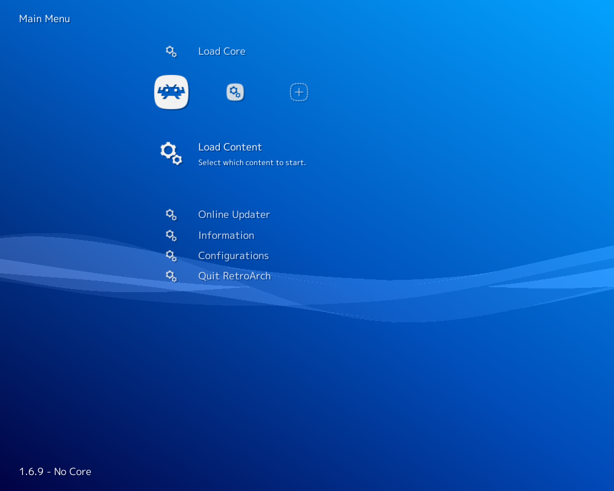

# Dinothawr

## Background

Dinothawr is a block pushing puzzle game on slippery surfaces. Our hero is a dinosaur whose friends are trapped in ice. Through puzzles it is your task to free the dinos from their ice prison.

#### How to start the Dinothawr core:

- To start the Dinothawr core, you need to obtain Dinothawr's data files. You can do this by going to RetroArch's main menu screen and selecting 'Online Updater'. From there, select 'Content Downloader'.

  

- Select 'Dinothawr', then select 'Dinothawr.zip'. This should download and extract this file to RetroArch's Downloads directory.

  

- Go back to RetroArch's main menu screen. Select 'Load Content', then 'Downloads'.

  

  

- Select the 'dinothawr' directory, then select 'dinothawr.game'.

- If you are asked which core to select, choose 'Dinothawr'.

The content should now start running!

### Author/License

The Dinothawr core has been authored by

- Themaister (programming, music, some level design)
- Agnes Heyer ((art, level design, some code)

The Dinothawr core is licensed under

- [Non-commercial](https://github.com/libretro/Dinothawr/blob/master/LICENSE)

A summary of the licenses behind RetroArch and its cores have found [here](../development/licenses.md).

## Extensions

Content that can be loaded by the Dinothawr core have the following file extensions:

- .game

## Databases

RetroArch database(s) that are associated with the Dinothawr core:

- [Dinothawr](https://github.com/libretro/libretro-database/blob/master/rdb/Dinothawr.rdb)

## Features

Frontend-level settings or features that the Dinothawr core respects.

| Feature           | Supported |
|-------------------|:---------:|
| Restart           | ✔         |
| Screenshots       | ✔         |
| Saves             | ✔         |
| States            | ✕         |
| Rewind            | ✕         |
| Netplay           | ✕         |
| Core Options      | ✔         |
| RetroAchievements | ✕         |
| RetroArch Cheats  | ✕         |
| Native Cheats     | ✕         |
| Controls          | ✔         |
| Remapping         | ✔         |
| Multi-Mouse       | ✕         |
| Rumble            | ✕         |
| Sensors           | ✕         |
| Camera            | ✕         |
| Location          | ✕         |
| Subsystem         | ✕         |
| [Softpatching](../guides/softpatching.md) | ✕         |
| Disk Control      | ✕         |
| Username          | ✕         |
| Language          | ✕         |
| Crop Overscan     | ✕         |
| LEDs              | ✕         |

### Directories

The Dinothawr core's internal core name is 'Dinothawr'

The Dinothawr core saves/loads to/from these directories.

**Frontend's Save directory**

- dinothawr.srm (Save data)

### Geometry and timing

- The Dinothawr core's core provided FPS is (FPS)
- The Dinothawr core's core provided sample rate is (Rate)
- The Dinothawr core's core provided aspect ratio is (Ratio)

## Customizing / Hacking

Dinothawr is fairly hackable. dinothawr.game is the game file itself. It is a simple XML file which points to all assets used by the game. Levels are organized in chapters. Levels themselves are created using the [Tiled](http://www.mapeditor.org/) editor. If you want to try making your own levels, make sure you use the "plain XML" format for .tmx files and not the default zlib base64.

[Dinothawr - Level Design guide (pdf)](http://retinaleclipse.com/dinothawr-guide.pdf)

## Core options

The Dinothawr core has the following option(s) that can be tweaked from the core options menu. The default setting is bolded. 

Settings with (Restart) means that core has to be closed for the new setting to be applied on next launch.

- **Timer as FPS reference** [dino_timer] (**enabled**|disabled)

	Use timer as FPS reference.
	
## Controllers

The Dinothawr core supports the following device type(s) in the controls menu, bolded device types are the default for the specified user(s):

### User 1 device types

- None - Doesn't disable input.
- **RetroPad** - Joypad - Stay on this.
- RetroPad w/Analog - Joypad - There's no reason to switch to this.

### Controller tables

#### Joypad

| User 1 Remap descriptors | RetroPad Inputs                             |
|--------------------------|---------------------------------------------|
| Push                     |           |
| D-Pad Up                 |     |
| D-Pad Down               |   |
| D-Pad Left               |   |
| D-Pad Right              |  |
| Menu                     |           |
| Reset                    |           |

## External Links

- [Official/Libretro Dinothawr Github Repository](https://github.com/libretro/Dinothawr)
- [Report Libretro Dinothawr Core Issues Here](https://github.com/libretro/Dinothawr/issues)