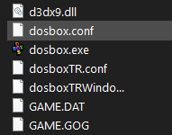
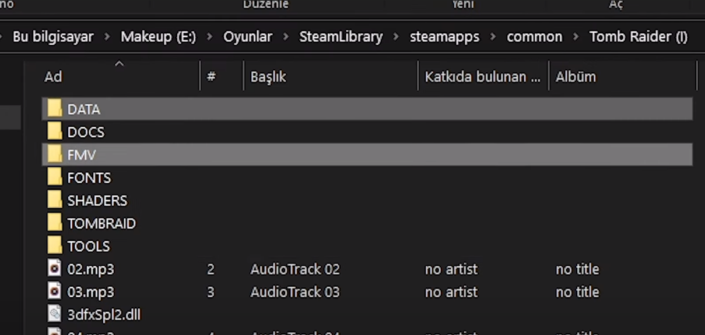
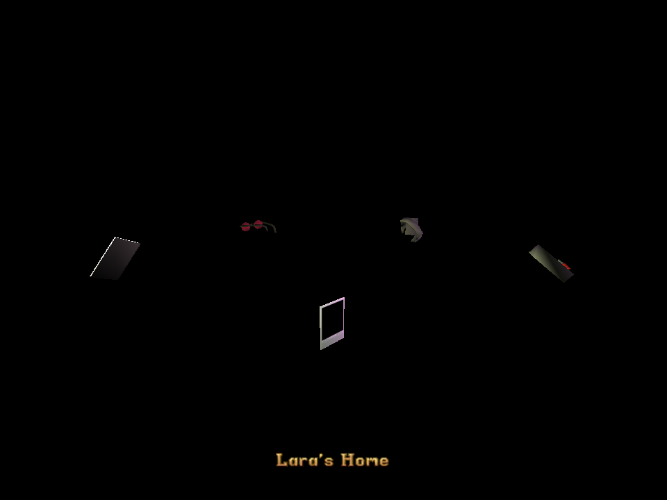
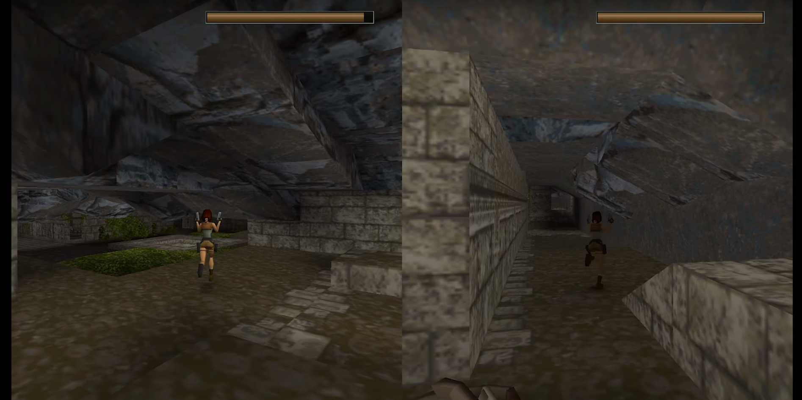
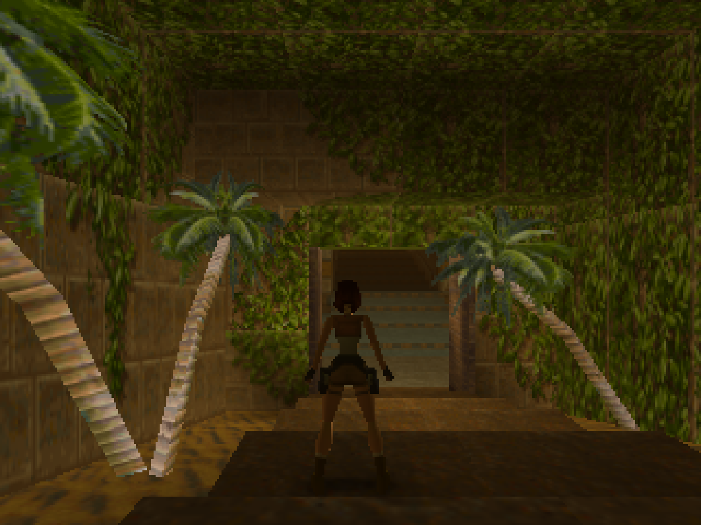
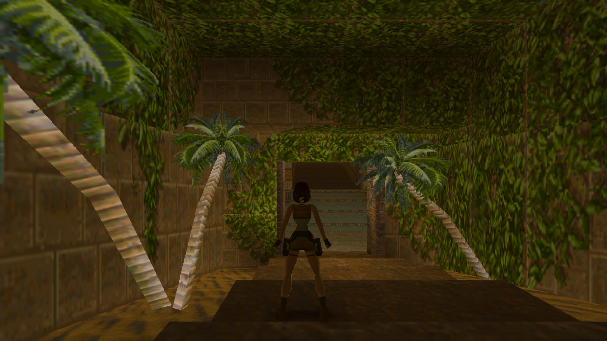

# Tomb Raider (OpenLara)

## Background

A new work-in-progress Tomb Raider game engine ported to libretro.

This game engine recreation seeks to allow you to play the original Tomb Raider engine games, from 1 all the way up to 5.

OpenLara V1 Tomb Raider 1 is fully playable.

The nice thing about OpenLara is that, while staying true to the original look and feel of the original, it also adds some enhancements to it that manages to make the boxy old-school Tomb Raider games look a bit less archaic. Some examples include :

- The framerate is no longer fixed to 30fps, and you can now run it at a smooth 60fps framerate. There are even more framerate options, allowing you to play at 90fps, 120fps or even 144fps.
- You can set the internal resolution of the game.
- New water effects which replaces the simple vertex manipulation of the water surface on the PSX. The Saturn version actually was the only version that tried to do something a bit more sophisticated with the water.
- Self-shadowing on all the player models (although this still has some visual anomalies at places).
- Improved lighting effects, including colored lighting (you can see the save crystals emanating a blue light for instance, something which definitely was not in any of the prior Tomb Raider versions).
- Shading effects – after Lara gets out of the water, her skin has a slightly wet shading effect.
- There is also a brand new local multiplayer mode. You toggle the game into splitscreen mode by pressing Start at any one time. From there, you can see a second Lara character, which is only distinguished from the main character by a slightly jerky animation update routine. Player 2 can now take control of this Lara and you can engage in ‘jolly co-operation’. At all times, Player 1 can beckon Player 2 back to his position by pressing the Start button, which resets player 2’s position back to Player 1’s so that Player 2 can always be brought back in case he/she is running too far astray.
- There is also a first person view that you can toggle into by pressing the Look button (L button) and then pressing the Action button (B button). This gives you a Mirror’s Edge-esque first person view.
- The ability to target two enemies at the same time individually.
- The graphical enhancements can all be toggled on/off inside the game’s inventory settings screen (toggleable by pressing the Select button).

The OpenLara core has been authored by

- XProger

The OpenLara core is licensed under

- [2-clause BSD](https://github.com/XProger/OpenLara/blob/master/LICENSE)

A summary of the licenses behind RetroArch and its cores can be found [here](../development/licenses.md).

## Requirements

This core requires that you use OpenGL as the video driver. Go to Settings -> Driver. If ‘video driver’ is set to ‘vulkan’, switch it back to ‘gl’, and then restart.


!!! attention
	There is currently no ‘working’ macOS version available due to the OpenGL requirement.

## Extensions

Content that can be loaded by the OpenLara core have the following file extensions:

- .phd
- .psx
- .tr2

RetroArch dat that is associated with the OpenLara core:

- [Tomb Raider](https://raw.githubusercontent.com/libretro/libretro-database/master/dat/Tomb%20Raider.dat)

## Setup

TR1 is officially supported while 2 or 3 is not. You can still load the levels of 2 or 3 and play them with the proper file scheme. You can download the demo from Online Updater > Content Downloader > Tomb Raider and test Level 2. You can also experience the OpenLara's features in the demo. Apart from that, you can buy it [here on GOG](https://www.gog.com/game/tomb_raider_123) or [here on Steam](https://store.steampowered.com/app/224960/Tomb_Raider_I/). Tomb Raider has differences between ports. The Steam and GOG version do not install the DATA and FMV folders directly into the directory. In Console versions, these files are in the image file.

<iframe width="560" height="315" src="https://www.youtube-nocookie.com/embed/F2GFAzouWQI" frameborder="0" allow="accelerometer; autoplay; clipboard-write; encrypted-media; gyroscope; picture-in-picture" allowfullscreen></iframe>

### Files

- DATA, with .phd and .pcx files inside. These are the level files and title screen textures.
- FMV, which contains a couple of .rpl files. These are the movies.

Not all audio files are available in the Steam/GOG distribution. In this case, you cannot hear some audio streams. For example, in the GYM level, you cannot hear Lara's instructions, but you can hear the sounds of walking, jumping and taking damage.

## Getting Tomb Raider files

First, make sure these steps are permissible in your locale RetroArch or LibRetro do not share copyrighted content. 

### Rip Tomb Raider 1 Image from Steam/GOG

When you get Tomb Raider on digital platforms, you will see *GAME.GOG*(game file), *GAME.DAT*, dosbox.exe and configuration file of dosbox inside the folder.

??? note "Files inside Tomb Raider 1 from Steam"
	

GOG files store audio samples in Drumagog format. This format was developed by WaveMachine Labs for a software plugin that offers access to acoustic drums samples. GOG files are associated with VST technology and are compatible with any software that supports it. GOG format was originally developed in 1999 and is regularly updated. 

Open the **dosbox.conf** file with a text editing file. Scroll down to until **[autoexec]**, lines in this section will be run at startup.

```
mount C .
        imgmount d ".\game.dat" -t iso -fs iso
        xcopy D:\DATA\ C:\DATA\
        xcopy D:\FMV\ C:\FMV\
```

When you paste the code above, **dosbox.exe** will boot the image and copy the **DATA** and **FMV** files in it to the local machine each time it is opened. The computer version does not contain most audio files. For example, when you export existing audio files, you cannot hear Lara's instructions at the GYM level.

??? note "Folders from Tomb Raider 1 image"
	

You must convert the audio files in the main folder of TR1 to .ogg format. You can do this with the small [FFmpeg](https://github.com/FFmpeg/FFmpeg) script below. Apart from that, you can use console audio files with PC port.

??? note "Converting to OGG"
	```
	for f in ./*.mp3; do ffmpeg -i "$f" -c:a libvorbis -q:a 4 "${f/%mp3/ogg}"; done
	```
	This will convert files from mp3 to ogg

The PC Port also missing title and loading images, you can get them from the console version. Place the **DELDATA** folder from the Console port into the main TR1 directory.

??? note "Missing Title Screen / Title Screen from Console"
	
	


### Rip Tomb Raider 1 Image from Console

[jPSXdec](https://github.com/m35/jpsxdec) is a modern, cross-platform PlayStation 1 audio/video converter. Check their documentation to understand how to use it.

## Folder Setup

To achieve a continuous game that loads from one level to the next you can load directly from CD
or preferably setup the content folder like this:

| Folder   | File Type(s)                             | Description                             |
|:--------:|:----------------------------------------:|:---------------------------------------:|
| audio/1/ | track_XX.ogg or XXX.ogg                  | X represents a number                   |
| audio/2/ | track_XX.ogg and MAIN.SFX                | Both tracks and MAIN.SFX are required   |
| audio/3/ | track_XX.ogg and MAIN.SFX                | Both tracks and MAIN.SFX are required   |
| level/1/ | *.PNG and *.PHD or *.PSX or *.SAT        | Load-screens and levels                 |
| level/2/ | *.PNG and *.TR2 or *.PSX                 | Load-screens and levels                 |
| level/3/ | *.PNG and *.TR2 or *.PSX                 | Load-screens and levels                 |
| video/1/ | *.RPL or *.FMV                           | Video cut-scenes                        |
| video/2/ | *.RPL or *.FMV                           | Video cut-scenes                        |
| video/3/ | *.RPL or *.FMV                           | Video cut-scenes                        |

!!! note
    if you load from CD you won't have soundtrack in TR1


## Features

Frontend-level settings or features that the OpenLara core respects.

| Feature           | Supported |
|-------------------|:---------:|
| Restart           | ✕         |
| Saves             | ✔         |
| States            | ✕         |
| Rewind            | ✕         |
| Netplay           | ✕         |
| Core Options      | ✔         |
| RetroAchievements | ✕         |
| RetroArch Cheats  | ✕         |
| Native Cheats     | ✕         |
| Controls          | ✔         |
| Remapping         | ✔         |
| Multi-Mouse       | ✕         |
| Rumble            | ✕         |
| Sensors           | ✕         |
| Camera            | ✕         |
| Location          | ✕         |
| Subsystem         | ✕         |
| [Softpatching](../guides/softpatching.md) | ✕         |
| Disk Control      | ✕         |
| Username          | ✕         |
| Language          | ✕         |
| Crop Overscan     | ✕         |
| LEDs              | ✕         |


### FPS mode

With OpenLara, you can experience Tomb Raider like you've never played before. You can try it through the eyes of Lara Croft with the primary person camera, for this you can switch to this mode by pressing L1 + A and exit this mode with the same combination. FPS also available in 2-Player Mode.

??? note "FPS mode"
	

### 2-Player Mode

You can include your friend with whom you want to pass TR levels together. Press Start from Second Controller in order to go 2-Payer Mode.

??? note "2-Player Mode"
	

## Directories

The OpenLara core's library name is 'OpenLara'

The OpenLara core saves/loads to/from these directories.

| File                        | Description  |
|:---------------------------:|:------------:|
| system/openlara/*.xsh       | Shader files |
| saves/openlara/savegame.dat | Savegame     |
| saves/openlara/settings     | Settings     |

## Geometry and timing

- The OpenLara core's core provided FPS is dependent on the ['Framerate' core option](#core-options).
- The OpenLara core's core provided sample rate is 44100 Hz
- The OpenLara core's base width is 320
- The OpenLara core's base height is 240
- The OpenLara core's max width is dependent on the ['Internal resolution' core option](#core-options)
- The OpenLara core's max height is dependent on the ['Internal resolution' core option](#core-options)
- The OpenLara core's core provided aspect ratio is 4/3

## Core options

The OpenLara core has the following option(s) that can be tweaked from the core options menu. The default setting is bolded.

Settings with (Restart) means that core has to be closed for the new setting to be applied on next launch.

- **Framerate (restart)** [openlara_framerate] (**60fps**|70fps|72fps|75fps|90fps|100fps|119fps|120fps|
144fps|240fps|244fps|15fps|30fps)

	Modify framerate. Requires a restart.

- **Internal resolution (restart)** [openlara_resolution] (**320x240**|360x480|480x272|512x384|512x512|640x240|
640x448|640x480|720x576|800x600|960x720|1024x768|
1024x1024|1280x720|1280x960|1600x1200|1920x1080|
1920x1440|1920x1600|2048x2048|2560x1440|
3840x2160|7680x4320|15360x8640|16000x9000)

	Modify the internal resolution. Requires a restart.

??? note "Internal resolution - 320x240"
	

??? note "Internal resolution - 1920x1080"
	

## Joypad

| RetroPad Inputs                                | User 1 input descriptors |
|------------------------------------------------|--------------------------|
|              | Action (Shoot/grab)      |
|              | Jump                     |
|         | Inventory                |
|          | Start                    |
|        | Up                       |
|      | Down                     |
|      | Left                     |
|     | Right                    |
|              | Roll                     |
|              | Draw weapon              |
|             | Walk (when holding)      |
|             | Duck/Crouch (TR3 and up) |
|             | Dash (TR3 and up)        |

## External Links

- [Official OpenLara Github Repository](https://github.com/XProger/OpenLara)
- [Official OpenLara Website](http://xproger.info/projects/OpenLara/)
- [Libretro OpenLara Core info file](https://github.com/libretro/libretro-super/blob/master/dist/info/openlara_libretro.info)
- [Libretro OpenLara Github Repository](https://github.com/libretro/OpenLara)
- [Report Libretro OpenLara Core Issues Here](https://github.com/libretro/libretro-meta/issues)
