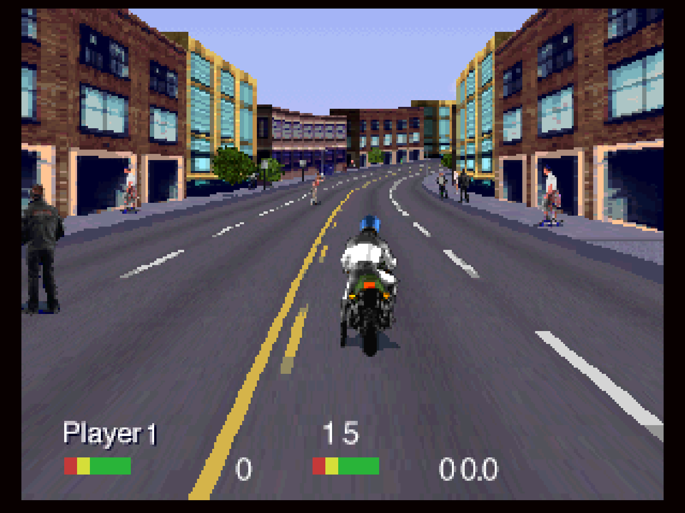
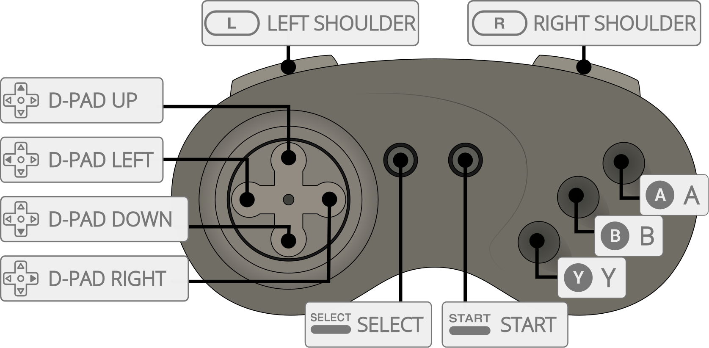
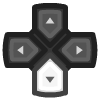

# The 3DO Company - 3DO (Opera)

## Background

Opera is an open-source, low-level emulator for the 3DO Game Console. Opera is a fork of 4DO, originally a port of 4DO, itself a fork of FreeDO, to libretro. The fork/rename occurred due to the original 4DO project being dormant and to differentiate the project due to new development and focus.

The Opera core has been authored by

- trapexit
- JohnnyDude
- FreeDO team

The Opera core is licensed under

- [Modified GNU LGPL / Non-commercial](https://github.com/libretro/opera-libretro/blob/master/libopera/opera_3do.c)

A summary of the licenses behind RetroArch and its cores can be found [here](../development/licenses.md).

## BIOS

One of the following system BIOSes is required to run software. Place in the frontend's system directory.

| Filename                    | Description                         | md5sum                           |
|:---------------------------:|:-----------------------------------:|:--------------------------------:|
| panafz1.bin                 | Panasonic FZ-1                      | f47264dd47fe30f73ab3c010015c155b |
| panafz10.bin                | Panasonic FZ-10                     | 51f2f43ae2f3508a14d9f56597e2d3ce |
| panafz10-norsa.bin          | Panasonic FZ-10 [RSA Patch]         | 1477bda80dc33731a65468c1f5bcbee9 |
| panafz10e-anvil.bin         | Panasonic FZ-10-E [Anvil]           | a48e6746bd7edec0f40cff078f0bb19f |
| panafz10e-anvil-norsa.bin   | Panasonic FZ-10-E [Anvil RSA Patch] | cf11bbb5a16d7af9875cca9de9a15e09 |
| panafz1j.bin                | Panasonic FZ-1J                     | a496cfdded3da562759be3561317b605 |
| panafz1j-norsa.bin          | Panasonic FZ-1J [RSA Patch]         | f6c71de7470d16abe4f71b1444883dc8 |
| goldstar.bin                | Goldstar  GDO-101M                  | 8639fd5e549bd6238cfee79e3e749114 |
| sanyotry.bin                | Sanyo IMP-21J TRY                   | 35fa1a1ebaaeea286dc5cd15487c13ea |
| 3do_arcade_saot.bin         | Shootout At Old Tucson              | 8970fc987ab89a7f64da9f8a8c4333ff |

## FONT ROM

Required for some Japanese games. Optional otherwise.

| Filename                   | Description                 | md5sum                           |
|:--------------------------:|:---------------------------:|:--------------------------------:|
| panafz1-kanji.bin          | Panasonic FZ-1 Kanji ROM    | b8dc97f778a6245c58e064b0312e8281 |
| panafz10ja-anvil-kanji.bin | Panasonic FZ-10JA Kanji ROM | 428577250f43edc902ea239c50d2240d |
| panafz1j-kanji.bin         | Panasonic FZ-1J Kanji ROM   | c23fb5d5e6bb1c240d02cf968972be37 |

## Extensions

Content that can be loaded by the Opera core have the following file extensions:

- .iso
- .bin
- .chd
- .cue

RetroArch database(s) that are associated with the Opera core:

- [The 3DO Company - 3DO](https://github.com/libretro/libretro-database/blob/master/rdb/The%203DO%20Company%20-%203DO.rdb)

## Features

Frontend-level settings or features that the Opera core respects.

| Feature           | Supported |
|-------------------|:---------:|
| Restart           | ✔         |
| Screenshots       | ✔         |
| Saves             | ✔         |
| States            | ✔         |
| Rewind            | ✔         |
| Netplay           | ✔         |
| Core Options      | ✔         |
| RetroAchievements | ✔         |
| RetroArch Cheats  | ✕         |
| Native Cheats     | ✕         |
| Controls          | ✔         |
| Remapping         | ✔         |
| Multi-Mouse       | ✕         |
| Rumble            | ✕         |
| Sensors           | ✕         |
| Camera            | ✕         |
| Location          | ✕         |
| Subsystem         | ✕         |
| [Softpatching](../guides/softpatching.md) | ✕         |
| Disk Control      | ✕         |
| Username          | ✕         |
| Language          | ✕         |
| Crop Overscan     | ✕         |
| LEDs              | ✕         |

### Directories

The Opera core's library name is 'Opera'

The Opera core saves/loads to/from these directories.

**Frontend's Save directory**

| File          | Description                |
|:-------------:|:--------------------------:|
| *.srm         | Per game NVRAM             |
| 3DO.nvram     | Shared NVRAM               |
| 3DO.nvram.tmp | Only used for atomic saves |

**Frontend's State directory**

| File     | Description |
|:--------:|:-----------:|
| *.state# | State       |

### Geometry and timing

- The Opera core's core provided FPS is 60
- The Opera core's core provided sample rate is 44100 Hz
- The Opera core's base width is 320 when the 'High Resolution' core option is set to disabled.
- The Opera core's base height is 240 when the 'High Resolution' core option is set to disabled.
- The Opera core's max width is 320 when the 'High Resolution' core option is set to disabled.
- The Opera core's max height is 240 when the 'High Resolution' core option is set to disabled.
- The Opera core's base width is 640 when the 'High Resolution' core option is set to enabled.
- The Opera core's base height is 480 when the 'High Resolution' core option is set to enabled.
- The Opera core's max width is 640 when the 'High Resolution' core option is set to enabled.
- The Opera core's max height is 480 when the 'High Resolution' core option is set to enabled.
- The Opera core's core provided aspect ratio is 4/3

## Core options

The Opera core has the following option(s) that can be tweaked from the core options menu. The default setting is bolded.

Settings with (Restart) means that core has to be closed for the new setting to be applied on next launch.

- **CPU overclock** [opera_cpu_overclock] (**1.0x (12.50Mhz)**|1.1x (13.75Mhz)|1.2x (15.00Mhz)|1.5x (18.75Mhz)|1.6x (20.00Mhz)|1.8x (22.50Mhz)|2.0x (25.00Mhz))

    The 3DO used a 12.5MHz ARM60 CPU as its central processor. We have implemented a CPU overclocking feature in the Opera core so that you can increase performance upto 2x.

    **May not have an impact on all games.**

    [https://www.youtube.com/watch?v=7bT2ecwKdHQ](https://www.youtube.com/watch?v=7bT2ecwKdHQ)

- **High Resolution** [opera_high_resolution] (**disabled**|enabled)

	The default internal resolution is 320x240, but the output resolution is 640x480. This feature makes the system behave as if it has a 640x480 framebuffer.

??? note "High Resolution - disabled"
	

??? note "High Resolution - enabled"
	

- **NVRAM Storage** [opera_nvram_storage] (**per game**|shared)

	Choose whether NVRAM saves are per game or NVRAM saves are shared between all games.

	Look at the [Directories section](#directories) for more information.

- **Active Devices** [opera_active_devices] (**1**|2|3|4|5|6|7|8|0)

	There is a bug (maybe in Opera but possibly in certain games) in which having more than 1 controller emulated causes the game not to respond to input. This allows working around the issue.

- **Timing Hack 1 (Crash 'n Burn)** [opera_hack_timing_1] (**disabled**|enabled)

	Enable this to fix Crash 'n Burn.

- **Timing Hack 3 (Dinopark Tycoon)** [opera_hack_timing_3] (**disabled**|enabled)

	Enable this to fix Dinopark Tycoon.

- **Timing Hack 5 (Microcosm)** [opera_hack_timing_5] (**disabled**|enabled)

	Enable this to fix Microcosm.

- **Timing Hack 6 (Alone in the Dark)** [opera_hack_timing_6] (**disabled**|enabled)

    Enable this to fix Alone in the Dark.

- **Graphics Step Y Hack (Samurai Shodown)** [opera_hack_graphics_step_y] (**disabled**|enabled)

	Enable this to fix Samurai Shodown's background rendering.

## Joypad

| User 1 - 2 Remap descriptors | RetroPad Inputs                                |
|------------------------------|------------------------------------------------|
| B                            |              |
| A                            |              |
| X (Stop)                     |         |
| P (Play/Pause)               |          |
| D-Pad Up                     |        |
| D-Pad Down                   |      |
| D-Pad Left                   |      |
| D-Pad Right                  |     |
| C                            |              |
| L                            |             |
| R                            |             |

## Compatibility

- [Opera Core Compatibility List](http://wiki.fourdo.com/Compatibility_List)

## External Links

- [Official 4DO Website](http://www.fourdo.com/)
- [Official 4DO Wiki](http://wiki.fourdo.com/Main_Page)
- [Official 4DO SourceForge Repository](https://sourceforge.net/projects/fourdo/)
- [Libretro Opera Core info file](https://github.com/libretro/libretro-super/blob/master/dist/info/opera_libretro.info)
- [Libretro Opera Github Repository](https://github.com/libretro/opera-libretro)
- [Report Libretro Opera Core Issues Here](https://github.com/libretro/opera-libretro/issues)
