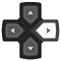

# Sony - PlayStation (PCSX2) WIP

<iframe width="560" height="315" src="https://www.youtube-nocookie.com/embed/-EnWeztB8wI" title="YouTube video player" frameborder="0" allow="accelerometer; autoplay; clipboard-write; encrypted-media; gyroscope; picture-in-picture" allowfullscreen></iframe>

PCSX2 is still under development. The content on this page is not the final version. Connecting a remote while any content is running may cause retroarch crashes. If you get a failed to load content warning, respectively; Check your BIOS, video driver(try to switch between drivers, use 'GL') and content. There’s a working OpenGL renderer and a Direct3D11 renderer option. Direct3D 11 renderer can be faster than OpenGL but also has less features. Pick whichever works best for you. On Xbox you will only be able to use Direct3D11 anyways. This core uses the x86_64 dynarec which was added to PCSX2 a year ago. It is still less compatible than the 32bit x86 dynarec in PCSX2, so keep that in mind. It’s for similar reasons that the software renderer right now won’t work (it’s not compatible yet with x86_64, not in upstream either). There’s a bug that can happen right now upon closing content or exiting RetroArch with the PCSX2 core on Windows – the RetroArch process might not completely cleanly shut itself off and you might still be able to see a 0% CPU process remaining in the Task Manager. We have not been able to figure out how to fix that yet as the PCSX2 codebase is a definite case of ‘here be dragons’, but for now when this happens, you can just bring up the Task Manager and close it manually. It shouldn’t have a real detriment on performance but it is of course far from ideal and hopefully something we can fix soon with the help of some contributors. We have found this happens the most with the Direct3D 11 renderers. Switching resolution at runtime right now can be a bit unstable, so does switching fullscreen resolution. We might just make resolution switching require a restart since this tends to be too unstable for now.

## Background

PCSX2 is a PlayStation®2 emulator capable of running commercial games. It's an open source project that runs on Windows, Mac and Linux. Like its predecessor project [PCSX](../library/pcsx_rearmed.md), it is based on a PSEmu Pro spec plug-in architecture, separating several functions from the core emulator. PCSX2 requires a copy of the PS2 BIOS, which is not available for download from the developers, due to the copyright concerns and legal issues associated with it.

PCSX2 is a free and open-source PlayStation 2 (PS2) emulator. Its purpose is to emulate the PS2's hardware, using a combination of MIPS CPU Interpreters, Recompilers and a Virtual Machine which manages hardware states and PS2 system memory. This allows you to play PS2 games on your PC, with many additional features and benefits.

PCSX2, supports a wide range of PlayStation 2 video games with a high level of compatibility and functionality. Although PCSX2 can closely mirror the original gameplay experience on the PlayStation 2, PCSX2 supports a number of improvements over gameplay on a traditional PlayStation 2, such as the ability to use custom resolutions up to 8192×8192, anti-aliasing, and texture filtering.

PCSX2 core has been authored by

- 

PCSX2 core is licensed under

- [GPLv2](https://github.com/libretro/pcsx2/blob/main/COPYING.GPLv2)
- [GPLv3](https://github.com/libretro/pcsx2/blob/main/COPYING.GPLv3)
- [LGPLv2.1](https://github.com/libretro/pcsx2/blob/main/COPYING.LGPLv2.1)
- [LGPLv3](https://github.com/libretro/pcsx2/blob/main/COPYING.LGPLv3)

A summary of the licenses behind RetroArch and its cores can be found [here](../development/licenses.md).

### Requirements

=== "CPU"

    * Supports SSE2/AVX2
    * PassMark Single Thread Performance rating near or greater than 1600/2100
    * Two physical cores, with hyperthreading
    * Four physical cores, with or without hyperthreading

=== "GPU"

	* Direct3D10/11 support
	* OpenGL 3.x/4.5 support
	* PassMark G3D Mark rating around 3000 (GeForce GTX 750)
	* 2 GB/4 GB Video Memory

=== "RAM"

	* 4GB/8GB

!!! Attention
	Because of the complex nature of emulation, even if you meet the recommended requirements there will be games that will NOT run at full speed due to emulation imperfection, floating point emulation differences, issues with emulator itself or other problems.

## BIOS

!!! TIP
	Interesting fact: For maximum compatibility it is recommended that you use a BIOS image different than SCPH10000.BIN which is the oldest one
	
!!! info
	Transfer your BIOS files to the retroarch/system/pcsx2/bios/ directory.

There is no region locking so if you have a PAL BIOS on your PS2 you can still play NTSC games, and vice versa. You'll also need the BIOS dumped from your PS2. Unlike the PS2 PCSX2 does not implement region locking so if you have a PAL BIOS in your PS2 you can still play NTSC games, and vice versa.

Required or optional firmware files go in the frontend's system directory.

A PlayStation 2 BIOS consists of multiple files. All files of the same version (e.g. the 6 files of "Japan v02.20") must be included in the BIOS directory for that specific version of the BIOS to work properly.

|   Filename   | Description                         |              md5sum              |
|:------------:|:-----------------------------------:|:--------------------------------:|
| PS2 Bios 30004R V6 Pal.bin | - | - |
| PS2 Bios 30004R V6 Pal.MEC | - | - |
| PS2 Bios 30004R V6 Pal.NVM | - | - |
| rom1.bin | - | - |
| scph10000.bin | - | - |
| scph10000.NVM | - | - |
| scph39001.bin | - | - |
| scph39001.MEC | - | - |
| scph39001.NVM | - | - |
| SCPH-70004_BIOS_V12_PAL_200.BIN | - | - |
| SCPH-70004_BIOS_V12_PAL_200.EROM | - | - |
| SCPH-70004_BIOS_V12_PAL_200.NVM | - | - |
| SCPH-70004_BIOS_V12_PAL_200.ROM1 | - | - |
| SCPH-70004_BIOS_V12_PAL_200.ROM2 | - | - |
| SCPH-70004_BIOS_V12_PAL_200.NVM | - | - |
| SCPH-77006_BIOS_VX_HK _220.BIN | Japan v02.20(10/02/2006) console BIOS | 5b1ba4bb914406fae75ab8e38901684d |
| SCPH-77006_BIOS_VX_HK _220.EROM | Japan v02.20(10/02/2006) console BIOS | 4f84fc8c2f1080a3f5f5859b403c62f3 |
| SCPH-77006_BIOS_VX_HK _220.mec | Japan v02.20(10/02/2006) console BIOS | 3faf7c064a4984f53e2ef5e80ed543bc |
| SCPH-77006_BIOS_VX_HK _220.NVM | Japan v02.20(10/02/2006) console BIOS | 5cc8e272eebfcc0f9efb9340e9644c57 |
| SCPH-77006_BIOS_VX_HK _220.ROM1 | Japan v02.20(10/02/2006) console BIOS | 905ebe2358502f8aaeeeac96d023f4d9 |
| SCPH-77006_BIOS_VX_HK _220.ROM2 | Japan v02.20(10/02/2006) console BIOS | 905ebe2358502f8aaeeeac96d023f4d9 |

## Other required files and directories

!!! info
	On Windows, if you previously installed the stand-alone PCSX2, Retroarch can detect the stand-alone files, so you only need to have the \pcsx2\bios\ folder in the System/BIOS directory. This doesn't work with the portable version or the stand-alone Linux version.

Currently, PCSX2 requires these directories in the folder set as frontend's System/BIOS directory:

.\pcsx2\bios\

.\pcsx2\cheats\

.\pcsx2\cheats_ws\

.\pcsx2\inis\

.\pcsx2\logs\

.\pcsx2\memcards\

.\pcsx2\snaps\

.\pcsx2\sstates\

It also requires a file 'portable.ini' in the the \pcsx2\ directory in the frontend's System/BIOS directory. Simply create a portable.txt file and change its extension to .ini.

## Extensions

Content that can be loaded by the PCSX2 core have the following file extensions:

- .elf
- .iso
- .ciso
- .chd
- .cso
- .cue
- .bin
- .mdf
- .nrg
- .dump
- .gz
- .img
- .m3u

RetroArch database(s) that are associated with the PCSX2 core:

- [Sony - PlayStation 2](https://github.com/libretro/libretro-database/blob/master/rdb/Sony%20-%20PlayStation%202.rdb)

## Features

Frontend-level settings or features that the PCSX2 core respects.

| Feature           | Supported |
|-------------------|:---------:|
| Restart           | ✔         |
| Screenshots       | ✔         |
| Saves             | ✔         |
| States            | ✕         |
| Rewind            | ✕         |
| Netplay           | ✕         |
| Core Options      | ✔         |
| RetroAchievements | ✕         |
| RetroArch Cheats  | ✕         |
| Native Cheats     | ✔         |
| Controls          | ✔         |
| Remapping         | ✔         |
| Multi-Mouse       | ✔         |
| Rumble            | ✔         |
| Sensors           | ✕         |
| Camera            | ✕         |
| Location          | ✕         |
| Subsystem         | ✕         |
| [Softpatching](../guides/softpatching.md) | ✕         |
| Disk Control      | ✕         |
| Username          | ✕         |
| Language          | ✕         |
| Crop Overscan[^2] | ✕         |
| LEDs              | ✕         |

### Directories

PCSX2's library name is 'pcsx2'

PCSX2 core saves/loads to/from these directories.

**Frontend's Save directory**

- Memory card - slot 1

..\retroarch\saves\pcsx2\Slot 1\

- Memory card - slot 1

..\retroarch\saves\pcsx2\Slot 2\

**Frontend's State directory**

| File     | Description |
|:--------:|:-----------:|
| *.state# | State      |

## Rumble support

Rumble only works in the PCSX2 core when

- The content being ran has rumble support.
- The frontend being used has rumble support.
- The joypad device being used has rumble support.
- The corresponding user's device type is set to **DualShock**
- The corresponding user's device type is set to **DualShock 2**

## Joypad

| User 1 - 8 input descriptors  | RetroPad Inputs                              | PlayStation Controller Inputs                  | DualShock Inputs                                | Analog Controller Inputs                        | Analog Joystick Inputs                         | neGcon Inputs                   |
|-------------------------------|----------------------------------------------|------------------------------------------------|-------------------------------------------------|-------------------------------------------------|------------------------------------------------|---------------------------------|
| Cross                         |              |       |        |        |       | Analog button I                 |
| Square                        |              |      |       |       |      | Analog button II                |
| Select                        |         |      |       |       |      |                                 |
| Start                         |          |       |        |        |       | Start                           |
| D-Pad Up                      |        |     |      |      |     | D-Pad Up                        |
| D-Pad Down                    |      |   |    |    |   | D-Pad Down                      |
| D-Pad Left                    |      |   |    |    |   | D-Pad Left                      |
| D-Pad Right                   |     |  |   |   |  | D-Pad Right                     |
| Circle                        |              |      |       |       |      | A                               |
| Triangle                      |              |    |     |     |    | B                               |
| L1                            |             |          |           |           |          | Left shoulder button (analog)   |
| R1                            |             |          |           |           |          | Right shoulder button (digital) |
| L2                            |             |          |           |           |          | Analog button II                |
| R2                            |             |          |           |           |          | Analog button I                 |
| L3                            |             |                                                  |           |                                                   |                                                |                                 |
| R3                            |             |                                                  |           |                                                   |                                                |                                 |
| Left Analog X                 |  X  |                                                  |   |   | Left Joystick X                                | Twist                           |
| Left Analog Y                 |  Y  |                                                  |   |   | Left Joystick Y                                |                                 |
| Right Analog X                |  X |                                                  |  |  | Right Joystick X                               |                                 |
| Right Analog Y                |  Y |                                                  |  |  | Right Joystick Y                               |                                 |

## Compatibility

The current standalone development version is reported to be compatible with approximately 97.4% of 2,641 tested games as of August 2020. Compatibility means only that the game will not crash, lock up, or enter a loop; there can still be bugs, missing post-processing effects, textures, and shadows in many compatible games. This is especially the case in hardware mode; a slower software mode is available for bugs without workarounds. You can check compatibilirt list in [here](https://pcsx2.net/compatibility-list.html)

## External Links

- [Official PCSX2 Website](https://pcsx2.net/)
- [Official PCSX2 Downloads](https://pcsx2.net/download.html)
- [PCSX2 Core info file](https://github.com/libretro/libretro-super/blob/master/dist/info/pcsx2_libretro.info)
- [PCSX2 Github Repository](https://github.com/libretro/pcsx2)
- [Report PCSX2 Core Issues Here](https://github.com/libretro/pcsx2/issues)

## Libretro PS2 cores

- Play!

[^2]: Overscan cropping available via Core Options instead of frontend settings
