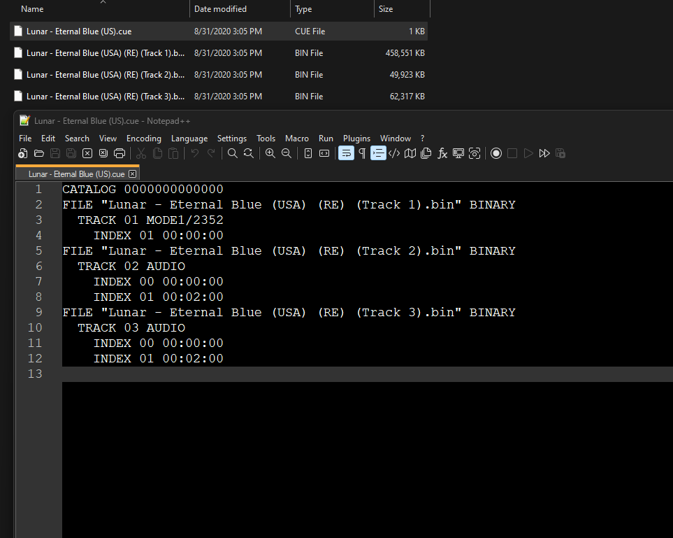
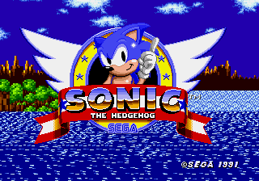
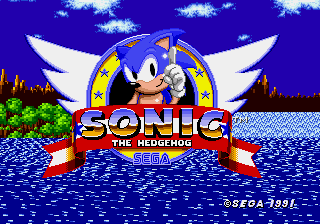
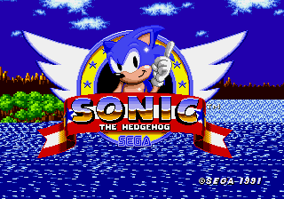

# Sega - MS/MD/CD/32X (PicoDrive)

## Background

PicoDrive is an open-source Sega 8/16 bit and 32X emulator which was written having ARM-based handheld devices in mind.

## Features

- Supports 32x emulation.
- Designed to run on weak devices.

The PicoDrive core has been authored by

- notaz
- fdave

The PicoDrive core is licensed under

- [Non-commercial](https://github.com/libretro/picodrive/blob/master/COPYING)

A summary of the licenses behind RetroArch and its cores can be found [here](../development/licenses.md).

## BIOS

Required or optional firmware files go in the frontend's system directory.

|   Filename    |    Description            |              md5sum              |
|:-------------:|:-------------------------:|:--------------------------------:|
| bios_CD_E.bin | MegaCD EU BIOS - Required | e66fa1dc5820d254611fdcdba0662372 |
| bios_CD_U.bin | SegaCD US BIOS - Required | 2efd74e3232ff260e371b99f84024f7f |
| bios_CD_J.bin | MegaCD JP BIOS - Required | 278a9397d192149e84e820ac621a8edd |

## Extensions

Content that can be loaded by the PicoDrive core have the following file extensions:

- .bin
- .gen
- .smd
- .md
- .32x
- .cue
- .iso
- .sms
- .68k

RetroArch database(s) that are associated with the PicoDrive core:

- [Sega - Master System - Mark III](https://github.com/libretro/libretro-database/blob/master/rdb/Sega%20-%20Master%20System%20-%20Mark%20III.rdb)
- [Sega - Mega-CD - Sega CD](https://github.com/libretro/libretro-database/blob/master/rdb/Sega%20-%20Mega-CD%20-%20Sega%20CD.rdb)
- [Sega - Mega Drive - Genesis](https://github.com/libretro/libretro-database/blob/master/rdb/Sega%20-%20Mega%20Drive%20-%20Genesis.rdb)
- [Sega - PICO](https://github.com/libretro/libretro-database/blob/master/rdb/Sega%20-%20PICO.rdb)
- [Sega - 32X](https://github.com/libretro/libretro-database/blob/master/rdb/Sega%20-%2032X.rdb)

## Features

Frontend-level settings or features that the PicoDrive core respects.

| Feature           | Supported |
|-------------------|:---------:|
| Restart           | ✔         |
| Saves             | ✔         |
| States            | ✔         |
| Rewind            | ✔         |
| Netplay           | ✔         |
| Core Options      | ✔         |
| RetroAchievements | ✔         |
| RetroArch Cheats  | ✔         |
| Native Cheats     | ✕         |
| Controls          | ✔         |
| Remapping         | ✔         |
| Multi-Mouse       | ✕         |
| Rumble            | ✕         |
| Sensors           | ✕         |
| Camera            | ✕         |
| Location          | ✕         |
| Subsystem         | ✕         |
| [Softpatching](../guides/softpatching.md) | ✕         |
| Disk Control      | ✔         |
| Username          | ✕         |
| Language          | ✕         |
| Crop Overscan     | ✕         |
| LEDs              | ✕         |

## Directories

The PicoDrive core's library name is 'PicoDrive'

The PicoDrive core saves/loads to/from these directories.

**Frontend's Save directory**

| File  | Description           |
|:-----:|:---------------------:|
| *.srm | Cartridge backup save |

**Frontend's State directory**

| File     | Description |
|:--------:|:-----------:|
| *.state# | State       |

## Geometry and timing

- The PicoDrive core's core provided FPS is 60 for NTSC games and 50 for PAL games.
- The PicoDrive core's core provided sample rate is 44100 Hz
- The PicoDrive core's base width is 320
- The PicoDrive core's base height is 224
- The PicoDrive core's max width is 320
- The PicoDrive core's max height is 240
- The PicoDrive core's core provided aspect ratio is 10/7 when the ['Core-provided aspect ratio' core option](#core-options) is set to PAR
- The PicoDrive core's core provided aspect ratio is 4/3 when the ['Core-provided aspect ratio' core option](#core-options) is set to 4/3
- The PicoDrive core's core provided aspect ratio is 5/4 when the ['Core-provided aspect ratio' core option](#core-options) is set to CRT

## Loading Sega CD games

When loading Sega CD games, PicoDrive needs a cue-sheet that points to an image file. A cue sheet, or cue file, is a metadata file which describes how the tracks of a CD or DVD are laid out.

If you have e.g. `foo.bin`, you should create a text file and save it as `foo.cue`. If the Sega CD game is single-track, the cue file contents should look like this:

```
 FILE "foo.bin" BINARY
  TRACK 01 MODE1/2352
   INDEX 01 00:00:00
```

After that, you can load the `foo.cue` file in RetroArch with the PicoDrive core.

!!! warning ""
    Certain Sega CD games are multi-track, so their .cue files might be more complicated.

Here's a cue file example done with Lunar - Eternal Blue (USA)



## Core options

The PicoDrive core has the following option(s) that can be tweaked from the core options menu. The default setting is bolded. 

Settings with (Restart) means that core has to be closed for the new setting to be applied on next launch.

- **Input device 1** [picodrive_input1] (**3 button pad**/6 button pad/None)

	Choose which kind of controller is plugged in slot 1.
	
- **"Input device 2** [picodrive_input2] (**3 button pad**/6 button pad/None)

	Choose which kind of controller is plugged in slot 2.
	
- **No sprite limit** [picodrive_sprlim] (**disabled**/enabled)

	Enable this to remove the sprite limit.
	
- **MegaCD RAM cart** [picodrive_ramcart] (**disabled**/enabled)

	Emulate a [MegaCD RAM cart](https://segaretro.org/CD_BackUp_RAM_Cart).
	
- **Region** [picodrive_region] (**Auto**/Japan NTSC/Japan PAL/US/Europe)

	Force a specific region.
	
- **Core-provided aspect ratio** [picodrive_aspect] (**PAR**/4/3/CRT)

	Choose the core-provided aspect ratio. RetroArch's aspect ratio must be set to Core provided in the Video settings.
	
??? note "Core-provided aspect ratio - PAR"
	
	
??? note "Core-provided aspect ratio - 4/3"
	

??? note "Core-provided aspect ratio - CRT"
		
	
- **Show Overscan** [picodrive_overscan] (**disabled**/enabled)

	Crop out the potentially random glitchy video output that would have been hidden by the bezel around the edge of a standard-definition television screen.
	
??? note "Show Overscan - Off"
	
	
??? note "Show Overscan - On"
		
	
- **68k overclock** [picodrive_overclk68k] (**disabled**/+25%/+50%/+75%/+100%/+200%/+400%)

	Overclock the emulated [68k chip](http://segaretro.org/M68000)
	
- **Dynamic recompilers** [picodrive_drc] (**enabled**/disabled)
	
	Enable dynamic recompilers which help to improve performance. **This core option is not available on all hardware.**

- **Audio filter** [picodrive_audio_filter] (**disabled**|low-pass)
	
	Enable a low pass audio filter to better simulate the characteristic sound of a Model 1 Genesis.
	
!!! attention
	This option is ignored when running Master System and PICO titles. Only the Genesis and its add-on hardware (Sega CD, 32X) employed a physical low pass filter.
	
- **Low-pass filter %** [picodrive_lowpass_range] (**60**|65|70|75|80|85|90|95|5|10|15|20|25|30|35|40|45|50|55)
	
	Specify the cut-off frequency of the audio low pass filter. A higher value increases the perceived 'strength' of the filter, since a wider range of the high frequency spectrum is attenuated.

## User 1 - 2 device types

The PicoDrive core supports the following device type(s).

- None - Input is disabled - Can be switched to using the Input device core options.
- **3 button pad** - Joypad - Can be switched to using the Input device core options.
- 6 button pad - Joypad - Can be switched to using the Input device core options.
- SMS pad - Joypad - Is automatically switched to when a Sega Master System game is loaded.

## Joypad

| RetroPad Inputs                                | User 1 - 2 input descriptors | 3 button pad | 6 button pad |
|------------------------------------------------|------------------------------|--------------|--------------|
|              | B                            | B            | B            |
|              | A                            | A            | A            |
|         | Mode                         |              | Mode         |
|          | Start                        | Start        | Start        |
|        | D-Pad Up                     | D-Pad Up     | D-Pad Up     |
|      | D-Pad Down                   | D-Pad Down   | D-Pad Down   |
|      | D-Pad Left                   | D-Pad Left   | D-Pad Left   |
|     | D-Pad Right                  | D-Pad Right  | D-Pad Right  |
|              | C                            | C            | C            |
|              | Y                            |              | Y            |
|             | X                            |              | X            |
|             | Z                            |              | Z            |

| RetroPad Inputs                                | User 1 - 2 input descriptors | SMS pad                   |
|------------------------------------------------|------------------------------|---------------------------|
|              | Button 1 Start               | Button 1 Start            |
|          | Button Pause                 | Button Pause              |
|        | D-Pad Up                     | D-Pad Up                  |
|      | D-Pad Down                   | D-Pad Down                |
|      | D-Pad Left                   | D-Pad Left                |
|     | D-Pad Right                  | D-Pad Right               |
|              | Button 2                     | Button 2                  |

## Compatibility

| 32x games                                    | Issue                                                         |
|----------------------------------------------|---------------------------------------------------------------|
| Brutal Unleashed – Above the Claw            | Softlocks after the first fight.                              |
| FIFA Soccer ’96                              | Glitched main menu text.                                      |
| Knuckles’ Chaotix                            | Glitched graphics on the Player Select screen.                |
| NBA Jam Tournament Edition                   | Framerate issues.                                             |
| NFL Quarterback Club                         | Some menu graphics are missing.                               |
| Virtua Racing Deluxe                         | Blinking line during the SEGA logo screen.                    |
| World Series Baseball Starring Deion Sanders | Crashes when starting a match.                                |
| WWF Raw                                      | Various graphics are missing.                                 |

## External Links

- [Official PicoDrive Website](http://notaz.gp2x.de/pico.php)
- [Official PicoDrive Github Repository](https://github.com/notaz/picodrive)
- [Libretro PicoDrive Core info file](https://github.com/libretro/libretro-super/blob/master/dist/info/picodrive_libretro.info)
- [Libretro PicoDrive Github Repository](https://github.com/libretro/picodrive)
- [Report Libretro PicoDrive Core Issues Here](https://github.com/libretro/picodrive/issues)

## Sega 16-bit

- [Sega - Master System (Emux SMS)](emux_sms.md)
- [Sega - MS/GG/MD/CD (Genesis Plus GX)](genesis_plus_gx.md)
- [Sega - MS/GG/SG-1000 (Gearsystem)](gearsystem.md)
- [MSX/SVI/ColecoVision/SG-1000 (blueMSX)](bluemsx.md)
