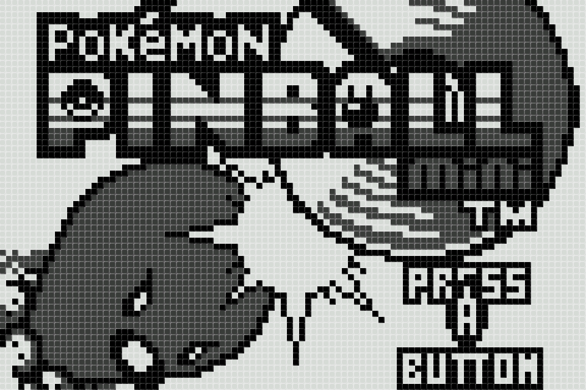
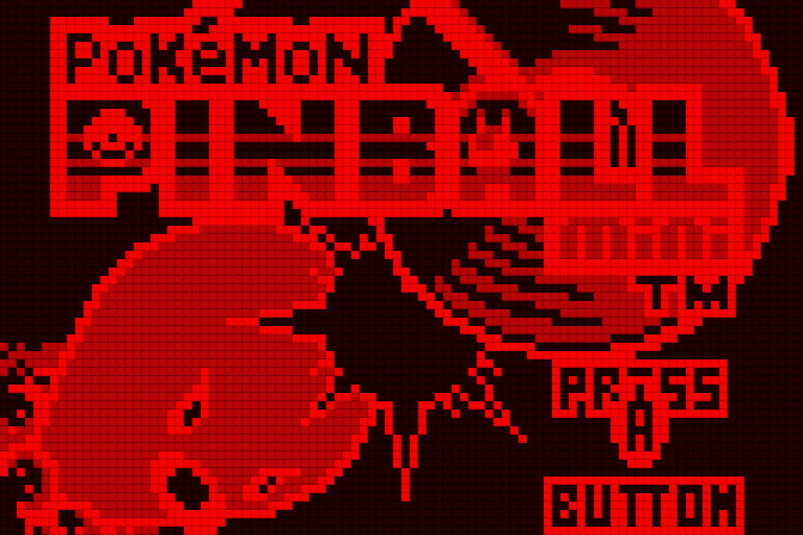
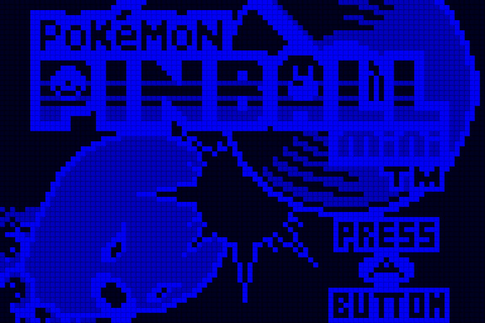

# Nintendo - Pokémon Mini (PokeMini)

## Background

PokeMini is an emulator for the [Pokémon Mini](https://en.wikipedia.org/wiki/Pok%C3%A9mon_Mini) handheld console.

The PokeMini core has been authored by

- JustBurn

The PokeMini core is licensed under

- [GPLv3](https://github.com/libretro/PokeMini/blob/master/LICENSE)

A summary of the licenses behind RetroArch and its cores can be found [here](../development/licenses.md).

## BIOS

Required or optional firmware files go in the frontend's system directory.

|   Filename    |    Description                |              md5sum              |
|:-------------:|:-----------------------------:|:--------------------------------:|
| bios.min      | Pokémon Mini BIOS - Optional  | 1e4fb124a3a886865acb574f388c803d |

## Extensions

Content that can be loaded by the PokeMini core have the following file extensions:

- .min

RetroArch database(s) that are associated with the PokeMini core:

- [Nintendo - Pokemon Mini](https://github.com/libretro/libretro-database/blob/master/rdb/Nintendo%20-%20Pokemon%20Mini.rdb)

## Features

Frontend-level settings or features that the PokeMini core respects.

| Feature           | Supported |
|-------------------|:---------:|
| Restart           | ✔         |
| Saves             | ✔         |
| States            | ✔         |
| Rewind            | ✔         |
| Netplay           | ✕         |
| Core Options      | ✔         |
| RetroAchievements | ✕         |
| RetroArch Cheats  | ✕         |
| Native Cheats     | ✕         |
| Controls          | ✔         |
| Remapping         | ✔         |
| Multi-Mouse       | ✕         |
| Rumble            | ✔         |
| Sensors           | ✕         |
| Camera            | ✕         |
| Location          | ✕         |
| Subsystem         | ✕         |
| [Softpatching](../guides/softpatching.md) | ✕         |
| Disk Control      | ✕         |
| Username          | ✕         |
| Language          | ✕         |
| Crop Overscan     | ✕         |
| LEDs              | ✕         |

## Directories

The PokeMini core's library name is 'PokeMini'

The PokeMini core saves/loads to/from these directories.

**Frontend's Save directory**

| File  | Description |
|:-----:|:-----------:|
| *.eep | EEPROM save |

**Frontend's State directory**

| File     | Description |
|:--------:|:-----------:|
| *.state# | State       |

## Geometry and timing

- The PokeMini core's core provided FPS is 72
- The PokeMini core's core provided sample rate is 44100 Hz
- The PokeMini core's base width is 96
- The PokeMini core's base height is 64
- The PokeMini core's max width is 576
- The PokeMini core's max height is 384
- The PokeMini core's core provided aspect ratio is 3/2

## Core options

The PokeMini core has the following option(s) that can be tweaked from the core options menu. The default setting is bolded.

Settings with (Restart) means that core has to be closed for the new setting to be applied on next launch.

- **Video Scale (Restart)** [pokemini_video_scale] (**4x**|5x|6x|1x|2x|3x)

	Sets internal video scale factor. Increasing the scale factor improves the appearance of the internal 'dotmatrix' LCD filter. Scale should normally be set to '1x' for correct operation when using an external GPU shader.

??? note "*'dotmatrix' LCD filter - Video Scale - 2x*"
    

??? note "*'dotmatrix' LCD filter - Video Scale - 4x*"
    

??? note "*'dotmatrix' LCD filter - Video Scale - 6x*"
    

- **LCD Filter** [pokemini_lcdfilter] (**dotmatrix**|scanline|none)

	Specifies which internal screen filter should be applied to the display. 'dotmatrix' produces a clean LCD effect, and is the recommended option. LCD filters are disabled when 'Video Scale' is set to '1x'.

??? note "*LCD Filter - dotmatrix*"
    

??? note "*LCD Filter - scanline*"
    

??? note "*LCD Filter - none*"
    

- **LCD Mode** [pokemini_lcdmode] (**analog**|3shades|2shades)

	Specifies the greyscale 'colour' reproduction characteristics of the emulated liquid crystal display.

	'analog' attempts to simulate the Pokémon Mini hardware by allowing smooth time-dependent transitions between 'colour' values. This option is recommended since most games exploited the analog nature of the Pokémon Mini screen to show different shades of 'colour' on a nominally monochrome display.

	'3shades' reduces the analog greyscale levels to three specific shades and removes all ghosting effects. It is adequate for most games.

	'2shades' causes the screen to behave as a purely digital monochrome display, either full light or full dark. WARNING: This will cause severe flickering in most games.

- **LCD Contrast** [pokemini_lcdcontrast] (**64**|0|16|32|48|80|96)

	Sets contrast level of emulated liquid crystal display.

- **LCD Brightness** [pokemini_lcdbright] (**0**|-80|-60|-40|-20|20|40|60|80)

	Sets brightness offset of emulated liquid crystal display.

- **Palette** [pokemini_palette] (**Default**|Old|Monochrome|Green|Green Vector|Red|Red Vector|Blue LCD|LEDBacklight|Girl Power|Blue|Blue Vector|Sepia|Monochrome Vector)

	Specifies palette used to 'colourise' the emulated liquid crystal display. 'Default' provides a close approximation of the natural screen tint of the original Pokémon Mini hardware. Palettes with a 'Vector' suffix correspond to inverted colours.

??? note "*Palette - Default*"
    

??? note "*Palette - Old*"
    

??? note "*Palette - Monochrome*"
    

??? note "*Palette - Green*"
    

??? note "*Palette - Green Vector*"
    

??? note "*Palette - Red*"
    

??? note "*Palette - Red Vector*"
    

??? note "*Palette - Blue LCD*"
    

??? note "*Palette - LEDBacklight*"
    

??? note "*Palette - Girl Power*"
    

??? note "*Palette - Blue*"
    

??? note "*Palette - Blue Vector*"
    

??? note "*Palette - Sepia*"
    

??? note "*Palette - Monochrome Vector*"
    

- **Piezo Filter** [pokemini_piezofilter] (**ON**|OFF)

	Enables an audio filter to more accurately simulate the characteristics of the Pokémon Mini's piezoelectric speaker.

- **Rumble Level (Screen + Controller)** [pokemini_rumblelvl] (**3**|2|1|0)

	Specifies the magnitude of the force feedback effect, both virtual ('screen shake') and physical ('controller rumble').

- **Controller Rumble** [pokemini_controller_rumble] (**ON**|OFF)

	Enables physical force feedback effect via controller rumble.

- **Screen Shake** [pokemini_screen_shake] (**ON**|OFF)

	Enables virtual force feedback effect by 'shaking' the screen. This is helpful when using a controller without physical rumble support, since a number of games rely on force feedback to prompt user action.

## Rumble

Rumble only works in the PokeMini core when

- The content being ran has rumble support.
- The frontend being used has rumble support.
- The joypad device being used has rumble support.
- The core option 'Rumble Level' is set to any value other than '0'.
- The core option 'Controller Rumble' is set to 'ON'.

!!! attention
	If physical rumble is not supported, it is recommended to set the core option 'Screen Shake' to 'ON'.

## Joypad

| RetroPad Inputs                             | User 1 input descriptors |
|---------------------------------------------|--------------------------|
|           | B                        |
|      | Power                    |
|     | D-Pad Up                 |
|   | D-Pad Down               |
|   | D-Pad Left               |
|  | D-Pad Right              |
|           | A                        |
|          | Shake                    |
|          | C                        |

## Compatibility

| Game                 | Issue                                                            |
|----------------------|------------------------------------------------------------------|
| Pokemon Pinball Mini | EEPROM saves do not function correctly - use save states instead |
| Pokemon Race Mini    | EEPROM saves do not function correctly - use save states instead |

## External Links

- [Official PokeMini SourceForge Repository](https://sourceforge.net/projects/pokemini/)
- [Libretro PokeMini Core info file](https://github.com/libretro/libretro-super/blob/master/dist/info/pokemini_libretro.info)
- [Libretro PokeMini Github Repository](https://github.com/libretro/PokeMini)
- [Report Libretro PokeMini Core Issues Here](https://github.com/libretro/PokeMini/issues)