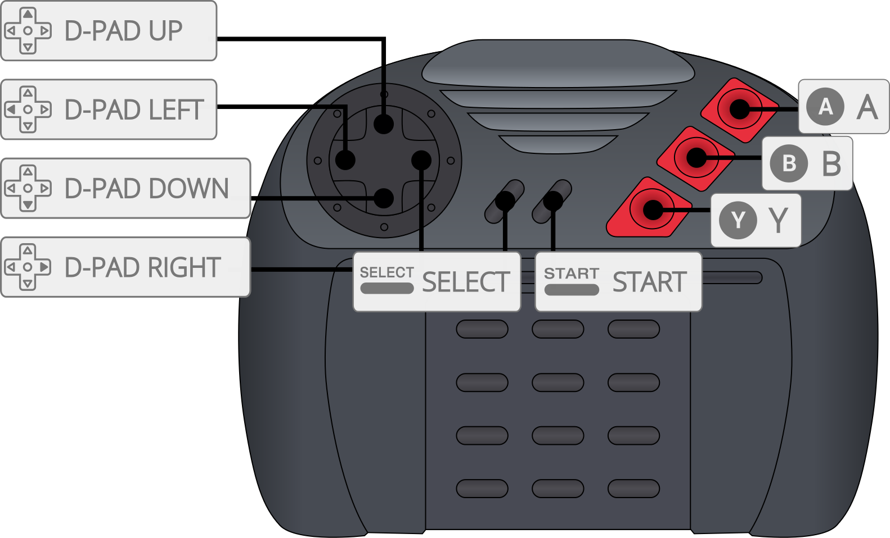
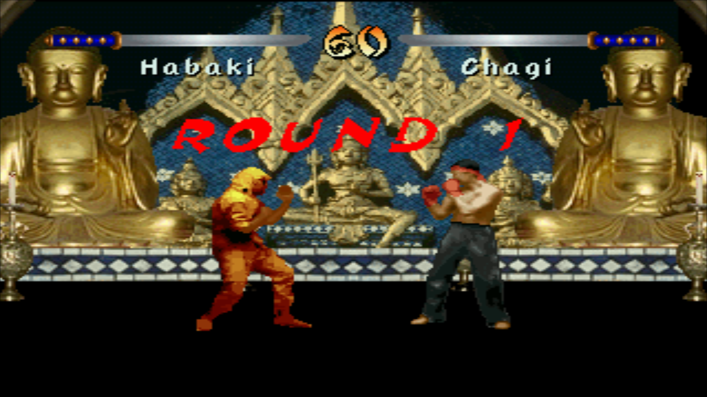

# Atari - Jaguar (Virtual Jaguar)

## Background

Virtual Jaguar is a portable Jaguar emulator which is based on the source code of what used to be Potato Emulation.

### Author/License

The Virtual Jaguar core has been authored by

- David Raingeard
- Shamus

The Virtual Jaguar core is licensed under

- [GPLv3](https://github.com/libretro/virtualjaguar-libretro/blob/master/docs/GPLv3)

A summary of the licenses behind RetroArch and its cores can be found [here](../development/licenses.md).

## Extensions

Content that can be loaded by the Virtual Jaguar core have the following file extensions:

- .j64
- .jag
- .rom
- .abs
- .cof
- .bin
- .prg

## Databases

RetroArch database(s) that are associated with the Virtual Jaguar core:

- [Atari - Jaguar](https://github.com/libretro/libretro-database/blob/master/rdb/Atari%20-%20Jaguar.rdb)

## Features

Frontend-level settings or features that the Virtual Jaguar core respects.

| Feature           | Supported |
|-------------------|:---------:|
| Restart           | ✔         |
| Screenshots       | ✔         |
| Saves             | ✔         |
| States            | ✕         |
| Rewind            | ✕         |
| Netplay           | ✕         |
| Core Options      | ✔         |
| RetroAchievements | ✕         |
| RetroArch Cheats  | ✕         |
| Native Cheats     | ✕         |
| Controls          | ✔         |
| Remapping         | ✔         |
| Multi-Mouse       | ✕         |
| Rumble            | ✕         |
| Sensors           | ✕         |
| Camera            | ✕         |
| Location          | ✕         |
| Subsystem         | ✕         |
| [Softpatching](../guides/softpatching.md) | ✕         |
| Disk Control      | ✕         |
| Username          | ✕         |
| Language          | ✕         |
| Crop Overscan     | ✕         |
| LEDs              | ✕         |

### Directories

The Virtual Jaguar core's internal core name is 'Virtual Jaguar'

The Virtual Jaguar core saves/loads to/from these directories.

**Frontend's Save directory**

| File        | Description            |
|:-----------:|:----------------------:|
| *.srm       | Cartridge EEPROM save  |
| *.cdrom.srm | CD-ROM EEPROM save     |

**Note:** When performing an in-game save, the Virtual Jaguar core creates both a Cartridge EEPROM save file and a CD-ROM EEPROM save file, regardless of the game type.

### Geometry and timing

- The Virtual Jaguar core's core provided FPS is 50 for PAL games and 60 for NTSC games.
- The Virtual Jaguar core's core provided sample rate is 48000 Hz
- The Virtual Jaguar core's core provided aspect ratio is 4/3

## Core options

The Virtual Jaguar core has the following option(s) that can be tweaked from the core options menu. The default setting is bolded.

Settings with (Restart) means that core has to be closed for the new setting to be applied on next launch.

- **Fast Blitter** [virtualjaguar_usefastblitter] (**disabled**|enabled)

	This option will force Virtual Jaguar to use the older, less compatible yet faster blitter. Some games will not work properly with this option on.

- **Doom Res Hack** [virtualjaguar_doom_res_hack] (**disabled**|enabled)

	A hack that needs to be enabled for Doom to run at its correct resolution.

??? note "*Doom Res Hack - Disabled*"
    

??? note "*Doom Res Hack - Enabled*"
    

- **Bios** [virtualjaguar_bios] (**disabled**|enabled)

	Enables BIOS loading sequence.

??? note "*Bios - Enabled*"
    

- **Pal (Restart)** [virtualjaguar_pal] (**disabled**|enabled)

	NTSC to PAL switch. Setting this to on switches to PAL mode.

## Controllers

The Virtual Jaguar core supports the following device type(s) in the controls menu, bolded device types are the default for the specified user(s):

### User 1 - 2 device types

- None - Doesn't disable input. There's no reason to switch to this.
- **RetroPad** - Joypad - Stay on this.
- RetroPad w/Analog - Joypad - Same as RetroPad. There's no reason to switch to this.

### Controller tables

#### Joypad

| User 1 - 2 Remap descriptors | RetroPad Inputs                             |
|------------------------------|---------------------------------------------|
| B                            |           |
| C                            |           |
| Pause                        |      |
| Option                       |       |
| D-Pad Up                     |     |
| D-Pad Down                   |   |
| D-Pad Left                   |   |
| D-Pad Right                  |  |
| A                            |           |
| Numpad 0                     |           |
| Numpad 1                     |          |
| Numpad 2                     |          |
| Numpad 3                     |          |
| Numpad 4                     |          |
| Numpad 5                     |          |
| Numpad 6                     |          |

#### Keyboard
| User 1 Joypad Descriptors    | Keyboard Inputs                             |
|------------------------------|---------------------------------------------|
| Numpad 0                     | 0
| Numpad 1                     | 1
| Numpad 2                     | 2
| Numpad 3                     | 3
| Numpad 4                     | 4
| Numpad 5                     | 5
| Numpad 6                     | 6
| Numpad 7                     | 7
| Numpad 8                     | 8
| Numpad 9                     | 9
| Numpad *                     | -
| Numpad #                     | =
## Compatibility

A reference compatibility table can be found on the bottom of this [page](https://icculus.org/virtualjaguar/)

| Game           | Issue                                                   |
|----------------|---------------------------------------------------------|
| Cybermorph     | Graphics glitches. (1)                                  |
| Doom           | Enable Doom core option hack for proper graphics pitch. |
| Iron Soldier   | Hangs after selecting a stage.                          |
| Iron Soldier 2 | Hangs after selecting a stage. Audio glitches.          |
| Kasumi Ninja   | Graphics glitches. Missing background layers (2)        |
| Ruiner Pinball | Doesn't boot.                                           |
| Super Burnout  | Hangs after selecting a track.                          |
| Towers II      | Heavy flickering.                                       |
| Wolfenstein 3D | ROM version doesn't boot, J64 version does.             |

??? note "(1)"
    

??? note "(2)"
    

## External Links

- [Official Virtual Jaguar Website](https://icculus.org/virtualjaguar/)
- [Official Virtual Jaguar Git Repository](http://shamusworld.gotdns.org/git/virtualjaguar)
- [Libretro Virtual Jaguar Core info file](https://github.com/libretro/libretro-super/blob/master/dist/info/virtualjaguar_libretro.info)
- [Libretro Virtual Jaguar Github Repository](https://github.com/libretro/virtualjaguar-libretro)
- [Report Libretro Virtual Jaguar Core Issues Here](https://github.com/libretro/virtualjaguar-libretro/issues)
