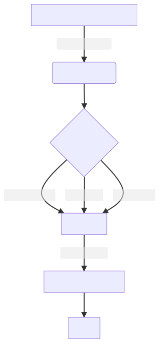

---
hide:
  - navigation
  - toc
---

Here we will touch on some critical topics and run our first content.

| :warning: WARNING          |
|:---------------------------|
| RetroArch or LibRetro do not illegally share copyrighted content. There is no support for the reproduction or distribution of copyrighted content.    |  

### Cores

RetroArch requires cores to run any content. A core is a program that has been ported to the libretro API and runs inside a libretro frontend. You can download cores directly from RetroArch's interface by following this procedure:

- Navigate to **Online Updater**
- Navigate to **Select Core Downloader**
- Select the core you want to download

| :warning: TIP          |
|:---------------------------|
| The online updater option may be hidden in some cases and there may be several reasons for this, for example, the distribution of Cores in the Steam version depends on permissions and licenses.   | 

### Running Content

After you have installed one or more cores you can run your content following this procedure:

- Navigate to **Load Content**
- Browse to the folder that contains the content you want to run
- Select the content that you want to run
- If you have more than one compatible core you will be asked to select the core you want to use for that purpose

And here is the fancy diagram down below:

